# Pre-Push Review Skill Implementation Plan

> **For Claude:** REQUIRED SUB-SKILL: Use superpowers:executing-plans to implement this plan task-by-task.

**Goal:** Add a comprehensive pre-push/pre-PR branch review skill that diffs against the base branch and gates on plan adherence, code quality, commit hygiene, and regression testing.

**Architecture:** New plugin (`pre-push-review`) following the same structure as the existing `regression-test` plugin. One SKILL.md orchestrator with two supporting reference docs (code-quality-rules.md, commit-hygiene-rules.md). Registered in the root marketplace.json.

**Tech Stack:** Markdown skill files, YAML frontmatter, Claude Code plugin system

---

### Task 1: Create plugin metadata

**Files:**
- Create: `plugins/pre-push-review/.claude-plugin/plugin.json`

**Step 1: Create the directory structure**

```bash
mkdir -p plugins/pre-push-review/.claude-plugin
mkdir -p plugins/pre-push-review/skills/pre-push-review
```

**Step 2: Write plugin.json**

Create `plugins/pre-push-review/.claude-plugin/plugin.json` with:

```json
{
  "name": "pre-push-review",
  "description": "Comprehensive branch review before push or PR. Diffs against the base branch and gates on plan adherence, code quality, commit hygiene, and regression testing. Produces a PASS/FAIL verdict with remediation plan on failure.",
  "author": {
    "name": "Marcel Roozekrans"
  }
}
```

**Step 3: Verify file exists**

```bash
cat plugins/pre-push-review/.claude-plugin/plugin.json
```

Expected: JSON content matches above.

**Step 4: Commit**

```bash
git add plugins/pre-push-review/.claude-plugin/plugin.json
git commit -m "feat(pre-push-review): add plugin metadata"
```

---

### Task 2: Write commit-hygiene-rules.md

**Files:**
- Create: `plugins/pre-push-review/skills/pre-push-review/commit-hygiene-rules.md`

**Step 1: Write the reference document**

Create `plugins/pre-push-review/skills/pre-push-review/commit-hygiene-rules.md` with the following content. This document defines all commit and file hygiene checks. Follow the same structural conventions as `visual-criteria.md` and `test-framework-detection.md` (section headers, tables, severity levels, "what to look for" / "good examples" / "bad examples" pattern).

```markdown
# Commit Hygiene Rules

This document defines the commit and file hygiene checks performed during Phase 4 (Commit Hygiene Review) of the pre-push-review skill.

---

## 1. Commit Message Quality

Evaluate whether commit messages are clear, conventional, and informative.

### What to check

- Messages follow the project's commit convention (Conventional Commits, Angular, custom)
- If no convention is detected, check that messages are:
  - Written in imperative mood ("Add feature" not "Added feature")
  - Under 72 characters for the subject line
  - Non-empty and descriptive (not "fix", "wip", "asdf", "temp")
- Multi-line messages have a blank line between subject and body
- No duplicate consecutive commits with the same message

### Detection

Check for commit conventions in this order:
1. `.commitlintrc.*`, `commitlint.config.*` — Commitlint configuration
2. `.czrc`, `.cz.json`, `cz-customizable` in package.json — Commitizen
3. `CONTRIBUTING.md` or `CLAUDE.md` — documented conventions
4. If none found: apply basic quality checks only

### Severity

| Level | Condition |
|---|---|
| **Warning** | WIP or meaningless commit messages ("fix", "update", "stuff"); subject line over 72 characters |
| **Info** | Minor style inconsistencies; missing body on complex changes |

---

## 2. Secrets and Credentials

Detect accidentally committed secrets, API keys, passwords, and tokens.

### What to check

Scan the full diff (`git diff <base>...HEAD`) for these patterns:

| Pattern | Description |
|---|---|
| `(?i)(api[_-]?key\|secret[_-]?key\|access[_-]?token\|auth[_-]?token)\s*[=:]\s*['"][^'"]{8,}` | API keys and tokens assigned inline |
| `(?i)(password\|passwd\|pwd)\s*[=:]\s*['"][^'"]+['"]` | Hardcoded passwords |
| `(?i)(aws[_-]?access[_-]?key[_-]?id\|aws[_-]?secret[_-]?access[_-]?key)\s*[=:]` | AWS credentials |
| `-----BEGIN (RSA\|DSA\|EC\|OPENSSH) PRIVATE KEY-----` | Private keys |
| `(?i)(ghp_[a-zA-Z0-9]{36}\|github_pat_[a-zA-Z0-9]{22}_[a-zA-Z0-9]{59})` | GitHub tokens |
| `(?i)sk-[a-zA-Z0-9]{20,}` | OpenAI/Stripe-style secret keys |
| `(?i)(ANTHROPIC_API_KEY\|OPENAI_API_KEY\|STRIPE_SECRET_KEY)\s*=\s*['"]?[a-zA-Z0-9_-]{20,}` | Known service API keys |

### Files to flag if committed

These files should almost never be committed:

- `.env`, `.env.local`, `.env.production`, `.env.*.local`
- `credentials.json`, `service-account.json`
- `*.pem`, `*.key` (private keys)
- `id_rsa`, `id_ed25519` (SSH keys)

### Severity

| Level | Condition |
|---|---|
| **Blocker** | Any secret, API key, password, or private key detected in the diff; `.env` file with actual values committed |
| **Warning** | `.env.example` or `.env.template` committed with placeholder values (acceptable but verify) |

---

## 3. Unintended Files

Detect files that should not be in version control.

### What to check

Scan the list of changed files (`git diff <base>...HEAD --name-only`) for:

| Pattern | Description |
|---|---|
| `node_modules/**` | Dependencies (should be in .gitignore) |
| `dist/**`, `build/**`, `out/**`, `.next/**` | Build artifacts |
| `*.min.js`, `*.min.css`, `*.bundle.js` | Minified/bundled files (usually generated) |
| `.DS_Store`, `Thumbs.db`, `desktop.ini` | OS-generated files |
| `*.log` | Log files |
| `*.sqlite`, `*.db` | Database files |
| `package-lock.json` changes without `package.json` changes | Lock file drift |
| Files larger than 1MB | Potentially large binaries or data files |

### Severity

| Level | Condition |
|---|---|
| **Blocker** | `node_modules` or build artifacts committed; database files with data |
| **Warning** | OS-generated files; large binary files; lock file changed without package.json change |
| **Info** | Log files; minor unintended files |

---

## 4. Merge Conflict Markers

Detect leftover merge conflict markers that were accidentally committed.

### What to check

Search the full diff for these exact patterns:

- `<<<<<<<` — conflict start marker
- `=======` — conflict separator
- `>>>>>>>` — conflict end marker

These should never appear in committed code.

### Severity

| Level | Condition |
|---|---|
| **Blocker** | Any merge conflict marker found in any file |

---

## 5. Large Files

Detect files that are unusually large for source code.

### What to check

For each file in the diff, check file size:

| Threshold | Description |
|---|---|
| > 5MB | Almost certainly a binary or data file that should not be in git |
| > 1MB | Likely a generated file, dataset, or binary |
| > 500KB | Suspicious for source code; investigate |

### Severity

| Level | Condition |
|---|---|
| **Blocker** | File > 5MB committed |
| **Warning** | File > 1MB committed |
| **Info** | File > 500KB committed |

---

## Applying These Rules

When reviewing commit hygiene:

1. Run `git log <base>..HEAD --oneline` to get all commits on the branch.
2. Run `git diff <base>...HEAD --name-only` to get all changed files.
3. Run `git diff <base>...HEAD` to get the full diff content.
4. Check each rule in order (1 through 5).
5. For each finding, record the file, line (if applicable), rule violated, and severity.
6. Any single **Blocker** finding means the branch fails the hygiene check.
```

**Step 2: Verify the file**

```bash
wc -l plugins/pre-push-review/skills/pre-push-review/commit-hygiene-rules.md
```

Expected: approximately 120-140 lines.

**Step 3: Commit**

```bash
git add plugins/pre-push-review/skills/pre-push-review/commit-hygiene-rules.md
git commit -m "feat(pre-push-review): add commit hygiene rules reference"
```

---

### Task 3: Write code-quality-rules.md

**Files:**
- Create: `plugins/pre-push-review/skills/pre-push-review/code-quality-rules.md`

**Step 1: Write the reference document**

Create `plugins/pre-push-review/skills/pre-push-review/code-quality-rules.md` with the following content. Follow the same structural conventions as the other reference docs.

```markdown
# Code Quality Rules

This document defines the code quality review criteria applied during Phase 3 (Code Quality Review) of the pre-push-review skill. All rules are evaluated against the diff between the feature branch and the base branch.

---

## 1. Security (OWASP Top 10)

Review changed code for common security vulnerabilities.

### What to check

| Vulnerability | Patterns to detect |
|---|---|
| **Injection (SQL/NoSQL)** | String concatenation in queries; template literals in SQL; missing parameterized queries |
| **XSS** | `innerHTML`, `dangerouslySetInnerHTML`, `v-html`, `[innerHTML]` without sanitization; unsanitized user input rendered in templates |
| **Broken Authentication** | Hardcoded credentials; weak password validation; missing rate limiting on auth endpoints |
| **Sensitive Data Exposure** | Logging sensitive data; returning passwords/tokens in API responses; missing encryption |
| **Broken Access Control** | Missing authorization checks on endpoints; client-side-only access control |
| **Security Misconfiguration** | CORS set to `*`; debug mode enabled in production config; verbose error messages exposing internals |
| **Insecure Deserialization** | `eval()`, `Function()`, `JSON.parse` on untrusted input without validation |
| **Using Known Vulnerable Components** | Dependencies with known CVEs (check if `npm audit` or similar is available) |

### Severity

| Level | Condition |
|---|---|
| **Blocker** | SQL/NoSQL injection; XSS vulnerability; hardcoded secrets; `eval()` on user input; CORS wildcard on authenticated endpoints |
| **Warning** | Missing input validation at API boundaries; overly permissive access control; debug mode in production config |
| **Info** | Minor security best-practice improvements; defense-in-depth suggestions |

---

## 2. YAGNI and Over-Engineering

Detect unnecessary complexity, premature abstractions, and speculative features.

### What to check

- Abstractions used only once (wrapper classes, factory patterns for single implementations)
- Feature flags or configuration for features that don't exist yet
- Generic solutions to specific problems (e.g., a plugin system for two hardcoded options)
- Excessive interface/type hierarchies with only one implementation
- Code that handles "future" requirements mentioned in comments but not in the plan
- Helper functions or utility modules that are called from only one location

### Severity

| Level | Condition |
|---|---|
| **Warning** | Abstractions with a single implementation; helper functions used once; feature flags for non-existent features |
| **Info** | Slightly verbose code that could be simpler; minor unnecessary generalization |

---

## 3. Debug and Temporary Code

Detect leftover debugging statements and temporary code.

### What to check

Search the diff for these patterns (in added lines only — lines starting with `+`):

| Pattern | Language | Description |
|---|---|---|
| `console.log`, `console.debug`, `console.warn` (non-error) | JS/TS | Debug logging |
| `debugger` | JS/TS | Breakpoint statement |
| `print(`, `pprint(` | Python | Debug print |
| `binding.pry`, `byebug` | Ruby | Debug breakpoints |
| `System.out.println` | Java | Debug print |
| `TODO`, `FIXME`, `HACK`, `XXX` | Any | Unfinished work markers |
| `@Ignore`, `x.skip`, `.only` | Any | Skipped or focused tests |
| `sleep(`, `Thread.sleep`, `time.sleep` | Any | Hardcoded delays (usually debug) |

### Exceptions

These are acceptable and should NOT be flagged:
- `console.error` — legitimate error logging
- `console.log` inside a dedicated logger/debug utility
- `TODO` in a comment that references a tracked issue (e.g., `TODO(#123)`)
- Test files containing `.skip` with an explanation comment

### Severity

| Level | Condition |
|---|---|
| **Warning** | `debugger` statements; `.only` on tests (would cause CI to run only one test); `sleep` calls in non-test code |
| **Info** | `console.log` statements; `TODO`/`FIXME` comments; `print()` statements |

---

## 4. Dead Code and Unused Imports

Detect code that is added but never referenced.

### What to check

- Imported modules/packages that are not used in the file
- Functions or classes defined but never called (within the diff scope)
- Commented-out code blocks (more than 3 consecutive commented lines of code)
- Variables assigned but never read
- Unreachable code after `return`, `throw`, `break`, or `continue`

### Severity

| Level | Condition |
|---|---|
| **Warning** | Commented-out code blocks (> 3 lines); unreachable code; defined functions with zero references in the diff |
| **Info** | Unused imports; single unused variables |

---

## 5. Error Handling

Evaluate error handling at system boundaries.

### What to check

- API endpoint handlers: do they catch and handle errors? Do they return appropriate status codes?
- External service calls (HTTP, database, file I/O): are they wrapped in try/catch or .catch()?
- Empty catch blocks (`catch (e) {}` or `catch { }`) — swallowing errors silently
- Catch blocks that only log and rethrow without adding context
- Promise chains without `.catch()` or missing `await` in async functions
- User-facing error messages that expose internal details (stack traces, SQL errors)

### Severity

| Level | Condition |
|---|---|
| **Warning** | Empty catch blocks; API endpoints without error handling; unhandled promise rejections; errors exposing internal details |
| **Info** | Catch blocks that could add more context; missing error boundaries in React components |

---

## 6. Naming and Readability

Evaluate code clarity and naming conventions.

### What to check

- Variable and function names are descriptive (not `x`, `temp`, `data`, `result` for non-trivial scopes)
- Naming follows the project's conventions (camelCase, snake_case, PascalCase as appropriate)
- Boolean variables/functions use `is`, `has`, `should`, `can` prefixes
- Functions do what their name says (no side effects hidden behind innocent names)
- Complex logic has explanatory comments or is broken into well-named helper functions
- Magic numbers and strings are extracted into named constants

### Severity

| Level | Condition |
|---|---|
| **Warning** | Misleading function/variable names; magic numbers in business logic; functions with hidden side effects |
| **Info** | Single-letter variables in non-trivial scope; missing comments on complex logic |

---

## 7. Test Coverage

Evaluate whether new or changed code is covered by tests.

### What to check

- New public functions/methods: do corresponding test files exist?
- New API endpoints: are there integration tests?
- Bug fixes: is there a regression test that would catch the bug if it recurred?
- Changed behavior: are existing tests updated to reflect the new behavior?
- Edge cases: are boundary conditions tested?

### Detection

For each new or modified source file in the diff:
1. Check if a corresponding test file exists (e.g., `foo.ts` → `foo.test.ts`, `foo.spec.ts`, `__tests__/foo.ts`)
2. If the file is new and has no test file, flag it
3. If the file is modified and its test file was not modified, flag it as a potential gap

### Severity

| Level | Condition |
|---|---|
| **Warning** | New public API/endpoint with no tests; bug fix with no regression test; changed behavior with unchanged tests |
| **Info** | New utility function without test (if simple/pure); minor code path without edge case test |

---

## Applying These Rules

When reviewing code quality:

1. Get the full diff: `git diff <base>...HEAD`
2. Identify all changed files and categorize them (source, test, config, docs)
3. For source files, apply rules 1-7 to the added and modified lines
4. For each finding, record: rule number, file path, line number (from diff), description, severity
5. Any single **Blocker** finding means the branch fails the code quality check
6. Three or more **Warning** findings also means the branch fails
```

**Step 2: Verify the file**

```bash
wc -l plugins/pre-push-review/skills/pre-push-review/code-quality-rules.md
```

Expected: approximately 150-170 lines.

**Step 3: Commit**

```bash
git add plugins/pre-push-review/skills/pre-push-review/code-quality-rules.md
git commit -m "feat(pre-push-review): add code quality rules reference"
```

---

### Task 4: Write SKILL.md (main orchestrator)

**Files:**
- Create: `plugins/pre-push-review/skills/pre-push-review/SKILL.md`

**Step 1: Write the main skill file**

Create `plugins/pre-push-review/skills/pre-push-review/SKILL.md` with the full orchestrator content. This is the longest file. Follow the exact structural conventions of the existing regression-test SKILL.md:
- YAML frontmatter with name and description
- Prerequisites section
- Overview with core principle
- Announce Line
- When to Use scenarios
- Checklist
- Process Flow (Graphviz)
- Detailed phase descriptions
- Red Flags
- Common Rationalizations table
- Quick Reference table
- Supporting References

```markdown
---
name: pre-push-review
description: Use when about to push a branch or create a PR - reviews the diff against the base branch for plan adherence, code quality, commit hygiene, and regression testing, producing a PASS/FAIL verdict with remediation plan
---

# Pre-Push Review Skill

## Prerequisites

This skill requires a **git repository** with at least one commit on a feature branch that differs from the base branch. No additional MCP servers are required for the core review.

**Optional:** If the project has a web UI and you want browser-based regression testing as part of the review, install the **Microsoft Playwright MCP server** (`@playwright/mcp`):

```bash
claude mcp add playwright -- npx @playwright/mcp@latest --caps=testing
```

## Overview

This skill defines a structured, comprehensive branch review process to run before pushing code or creating a pull request. The core principle is:

**"Never push without reviewing every change against the plan, the rules, and the tests."**

The review covers four dimensions: verifying that planned work was completed (and nothing unplanned snuck in), checking code quality against established rules, ensuring commits are clean and free of secrets or artifacts, and confirming that tests still pass. The result is a clear PASS or FAIL verdict. On failure, a prioritized remediation plan is generated with specific steps to fix each issue.

This skill can be invoked standalone (`/pre-push-review`) or as part of a larger workflow (e.g., before finishing a development branch or before creating a PR).

## Announce Line

When this skill is activated, begin with:

> "Starting pre-push review. I'll review the branch diff across four dimensions: plan adherence, code quality, commit hygiene, and regression testing. I'll auto-detect the base branch and produce a PASS/FAIL verdict."

## When to Use

Invoke this skill in any of the following situations:

- **Before pushing a branch** — The feature branch is ready and you want a quality gate before pushing to remote.
- **Before creating a PR** — You want to verify the branch is clean, complete, and ready for peer review.
- **After completing a development plan** — All planned tasks are done and you want to verify nothing was missed and nothing broke.
- **When asked to review the branch** — The user explicitly requests a branch review, diff review, or pre-push check.
- **Before merging** — A final quality gate before integrating changes into the main branch.
- **When finishing a development branch** — As part of the branch completion workflow, ensuring quality before the final step.

## Checklist

Use this checklist to track progress through the six phases:

- [ ] **Phase 1: Setup & Context** — Detect base branch, gather diff, find plan docs and project rules
- [ ] **Phase 2: Plan Adherence** — Compare changes against the plan document
- [ ] **Phase 3: Code Quality** — Review diff for security, YAGNI, debug code, dead code, error handling, naming, test coverage
- [ ] **Phase 4: Commit Hygiene** — Check commits for secrets, large files, unintended files, conflict markers, message quality
- [ ] **Phase 5: Regression Testing** — Run existing test suites and optionally browser-based testing
- [ ] **Phase 6: Verdict & Report** — Generate report with PASS/FAIL verdict and remediation plan if needed

## Process Flow

```dot
digraph pre_push_review {
    rankdir=TB;
    node [shape=box, style=rounded, fontname="Helvetica"];
    edge [fontname="Helvetica", fontsize=10];

    setup [label="Phase 1:\nSetup & Context"];
    detect_base [label="Auto-detect\nbase branch", shape=diamond];
    ask_base [label="Ask user for\nbase branch"];
    gather_diff [label="Gather diff,\nlog, changed files"];
    find_plan [label="Find plan docs\n& project rules"];

    has_plan [label="Plan doc\nexists?", shape=diamond];
    plan_review [label="Phase 2:\nPlan Adherence"];
    skip_plan [label="Skip plan review\n(note in report)"];

    code_quality [label="Phase 3:\nCode Quality"];
    commit_hygiene [label="Phase 4:\nCommit Hygiene"];

    has_tests [label="Test suites\nfound?", shape=diamond];
    run_tests [label="Phase 5:\nRun Tests"];
    skip_tests [label="Skip tests\n(note in report)"];

    has_ui [label="Web UI with\nURL available?", shape=diamond];
    regression [label="Invoke\nregression-test skill"];

    collect [label="Collect all\nfindings"];
    verdict [label="Phase 6:\nVerdict"];
    pass [label="PASS\n✓ Green light"];
    fail [label="FAIL\n✗ Generate\nremediation plan"];
    report [label="Generate\nreport"];
    summary [label="Conversation\nsummary"];

    setup -> detect_base;
    detect_base -> gather_diff [label="Found"];
    detect_base -> ask_base [label="Ambiguous"];
    ask_base -> gather_diff;
    gather_diff -> find_plan;
    find_plan -> has_plan;

    has_plan -> plan_review [label="Yes"];
    has_plan -> skip_plan [label="No"];
    plan_review -> code_quality;
    skip_plan -> code_quality;

    code_quality -> commit_hygiene;
    commit_hygiene -> has_tests;

    has_tests -> run_tests [label="Yes"];
    has_tests -> skip_tests [label="No"];
    run_tests -> has_ui;
    skip_tests -> has_ui;

    has_ui -> regression [label="Yes"];
    has_ui -> collect [label="No"];
    regression -> collect;

    collect -> verdict;
    verdict -> pass [label="No blockers\n< 3 warnings"];
    verdict -> fail [label="Any blocker\nor 3+ warnings"];
    pass -> report;
    fail -> report;
    report -> summary;
}
```



## Phase 1: Setup & Context Gathering

This phase establishes the review scope by identifying the base branch, gathering the diff, and locating relevant project documentation.

### Auto-Detect Base Branch

Determine the base branch using this priority order:

1. **Tracking branch** — Run `git rev-parse --abbrev-ref @{upstream} 2>/dev/null` to check if the current branch tracks a remote branch. If so, extract the base branch name.
2. **Common main branches** — Check if `main`, `master`, or `develop` branches exist using `git show-ref --verify refs/heads/<name>`.
3. **Ask the user** — If none of the above resolve, ask: "I couldn't auto-detect the base branch. Which branch should I diff against?"

### Gather the Diff

Once the base branch is identified, run these commands:

1. `git diff <base>...HEAD --stat` — Changed files summary (file names and change counts)
2. `git diff <base>...HEAD` — Full diff content for review
3. `git diff <base>...HEAD --name-only` — Plain list of changed file paths
4. `git log <base>..HEAD --oneline` — Commit history on this branch
5. `git log <base>..HEAD --format="%H %s"` — Commit hashes and messages for hygiene checks

### Find Plan Documents

Search for relevant plan or design documents:

1. Glob for `docs/plans/*.md` — Read each to see if it relates to the current branch or feature
2. Match by branch name: if the branch is `feat/user-auth`, look for plans mentioning "user auth" or "authentication"
3. Check for `CLAUDE.md` in the project root — project-level rules and conventions
4. Check for `.cursorrules`, `.windsurfrules`, or similar convention files

Record which plan document (if any) will be used for the plan adherence review.

## Phase 2: Plan Adherence Review

If a plan document was found in Phase 1, compare the actual changes against what was planned. If no plan was found, skip this phase and note it in the report.

### Steps

1. **Read the plan document** — Extract all planned tasks, features, and changes.

2. **Map plan items to diff** — For each planned item, check whether the diff contains corresponding changes:
   - Search for file paths mentioned in the plan
   - Search for function/class/component names mentioned in the plan
   - Search for feature descriptions that map to code changes

3. **Identify missing items** — List any planned items that have no corresponding changes in the diff. These are gaps that need to be addressed before pushing.

4. **Identify unplanned changes** — List any significant changes in the diff that are not mentioned in the plan. Minor changes (formatting, import reordering) are acceptable; new features or behavioral changes are not.

5. **Record findings** with severity:
   - **Blocker**: Planned feature entirely missing from the diff
   - **Warning**: Planned feature partially implemented; significant unplanned changes
   - **Info**: Minor unplanned changes (formatting, small refactors)

## Phase 3: Code Quality Review

Review the full diff for code quality issues. Apply the rules defined in [code-quality-rules.md](code-quality-rules.md).

### Steps

1. **Get the full diff** — Use the diff gathered in Phase 1.

2. **Categorize changed files** — Separate files into: source code, test files, configuration, documentation, and other. Focus the quality review on source code files.

3. **Apply each rule** from the code quality rules document:
   - Rule 1: Security (OWASP Top 10)
   - Rule 2: YAGNI and Over-Engineering
   - Rule 3: Debug and Temporary Code
   - Rule 4: Dead Code and Unused Imports
   - Rule 5: Error Handling
   - Rule 6: Naming and Readability
   - Rule 7: Test Coverage

4. **Focus on added and modified lines** — Only review lines that were changed (lines starting with `+` in the diff, excluding `+++` file headers). Do not flag issues in unchanged code.

5. **Record each finding** with: rule number, file path, line reference, description, and severity.

## Phase 4: Commit Hygiene Review

Review the commits and changed files for hygiene issues. Apply the rules defined in [commit-hygiene-rules.md](commit-hygiene-rules.md).

### Steps

1. **Check commit messages** — Review each commit message from `git log <base>..HEAD` against the commit message quality rules.

2. **Scan for secrets** — Search the full diff for secret patterns defined in the commit hygiene rules. Pay special attention to:
   - Newly added `.env` files
   - Inline API keys or tokens
   - Private keys

3. **Check for unintended files** — Review the changed files list for files that should not be in version control (node_modules, build artifacts, OS files, large binaries).

4. **Check for merge conflict markers** — Search the diff for `<<<<<<<`, `=======`, `>>>>>>>` patterns.

5. **Check file sizes** — For new files in the diff, check their sizes against the thresholds.

6. **Record each finding** with: rule number, file path, description, and severity.

## Phase 5: Regression Testing

Run existing test suites to verify the branch hasn't broken anything.

### Steps

1. **Detect test frameworks** — Use the same detection logic as the regression-test skill: check for config files (`jest.config.*`, `vitest.config.*`, `playwright.config.*`, `cypress.config.*`, etc.) and package.json scripts.

2. **Run test suites** — Execute each detected test suite:
   - Prefer package.json scripts (`npm test`, `npm run test:e2e`, etc.)
   - Fall back to direct runner commands (`npx jest`, `npx vitest run`, etc.)
   - Append reporter flags for parseable output

3. **Capture results** — Record:
   - Exit code
   - Total/passed/failed/skipped counts
   - Names and error messages of failing tests
   - Full output for the report

4. **Optional: Browser-based regression testing** — If the project has a web UI and the user confirms a URL is available, offer to invoke the regression-test skill for visual and functional browser testing. This is optional and requires user confirmation.

5. **Record findings**:
   - **Blocker**: Any test failure
   - **Warning**: Tests skipped with `.skip` or `@Ignore` (may indicate incomplete work)
   - **Info**: All tests passing; no test suites found (noted for awareness)

## Phase 6: Verdict & Report

Collect all findings from Phases 2-5, determine the verdict, and generate the report.

### Verdict Logic

| Condition | Verdict |
|---|---|
| Any **Blocker** finding in any phase | **FAIL** |
| Three or more **Warning** findings across all phases | **FAIL** |
| Fewer than 3 warnings and no blockers | **PASS** |

### Report Generation

Save the report to:

```
docs/pre-push-review-YYYY-MM-DD-HHmm.md
```

### Report Structure

#### Header

| Metric | Value |
|---|---|
| Date | YYYY-MM-DD HH:mm |
| Branch | (current branch name) |
| Base Branch | (base branch name) |
| Commits Reviewed | (count) |
| Files Changed | (count) |
| Lines Added | (count) |
| Lines Removed | (count) |
| Verdict | **PASS** or **FAIL** |

#### Plan Adherence Results

- Plan document used (or "No plan document found")
- Planned items: implemented / total
- Missing implementations (if any)
- Unplanned changes (if any)

#### Code Quality Results

- Findings grouped by rule, with file:line references
- Severity for each finding

#### Commit Hygiene Results

- Commit message quality assessment
- Secrets scan results
- Unintended files detected
- Merge conflict markers
- Large files

#### Regression Test Results

- Framework(s) detected
- Commands executed
- Pass/fail/skip counts
- Failing test details (if any)

#### Remediation Plan (FAIL verdict only)

When the verdict is FAIL, include a remediation plan:

1. **Numbered list of issues** ordered by severity (blockers first, then warnings)
2. **File and line references** for each issue
3. **Suggested fix** for each issue — specific, actionable instructions
4. **Effort estimate** per issue: Quick fix (< 5 min) / Moderate (5-30 min) / Significant (> 30 min)

### Conversation Summary

After generating the report, provide a concise summary in the conversation:

1. **Verdict** — PASS or FAIL in bold
2. **Issue counts** — X blockers, Y warnings, Z info items
3. **Top 3 findings** — The three most important issues (or "No issues found" on PASS)
4. **Remediation plan summary** — (FAIL only) Brief list of what needs fixing
5. **Report path** — Full file path to the generated report

## Red Flags

These are mistakes that compromise the quality of a pre-push review. If you notice yourself doing any of these, stop and correct course:

1. **Skipping the diff** — Every review must be based on the actual `git diff`. Do not make assumptions about what changed based on file names alone.

2. **Ignoring the plan** — If a plan document exists, it must be compared against the diff. Do not skip plan adherence because "the code looks fine."

3. **Glossing over security issues** — Every pattern match for secrets or security vulnerabilities must be investigated. Do not dismiss regex matches as false positives without examining the actual content.

4. **Not running tests** — If test suites exist, they must be run. Do not skip tests because "they probably pass" or "we only changed CSS."

5. **Soft-passing a failing review** — If blockers are found or warnings exceed the threshold, the verdict is FAIL. Do not rationalize a PASS verdict to avoid delivering bad news.

6. **Generating a report without reviewing** — The report must reflect actual review findings. Never generate a placeholder or optimistic report without completing all phases.

## Common Rationalizations

| Rationalization | Why It's Wrong | Correct Action |
|---|---|---|
| "It's just a small change, no need for a full review" | Small changes can contain secrets, break tests, or violate the plan | Run the full review process |
| "The tests passed in CI" | This review checks more than tests: plan adherence, code quality, commit hygiene | Complete all phases regardless of CI status |
| "I know this code is fine, I just wrote it" | Self-review bias is real; systematic checks catch what memory misses | Follow the process mechanically |
| "The plan is outdated, so skip plan adherence" | If the plan is outdated, that's a finding worth noting | Review against the plan; note discrepancies |
| "Those regex matches are just false positives" | Every match must be verified; real secrets look like false positives | Examine each match; only dismiss with evidence |
| "There are too many warnings, let's just note them" | Three or more warnings is a FAIL verdict; they indicate systematic issues | Apply the verdict rules strictly |
| "We can fix the commit messages later" | Commit messages are part of the permanent record; "later" rarely happens | Flag them now |

## Quick Reference

| Phase | Key Actions | Tools Used |
|---|---|---|
| Phase 1: Setup & Context | Detect base branch, gather diff, find plans | `git` commands, `Glob`, `Read` |
| Phase 2: Plan Adherence | Compare diff against plan document | `Read`, `Grep` |
| Phase 3: Code Quality | Review diff for 7 quality rules | `Grep`, diff analysis |
| Phase 4: Commit Hygiene | Check commits, secrets, files, markers | `git` commands, `Grep` |
| Phase 5: Regression Testing | Run test suites, optionally browser testing | `Bash` (test runners), optionally Playwright MCP |
| Phase 6: Verdict & Report | Generate report, determine PASS/FAIL | `Write` (markdown report) |

## Supporting References

The following companion documents provide detailed criteria referenced throughout this skill:

- [code-quality-rules.md](code-quality-rules.md) — Detailed code review criteria covering security, YAGNI, debug code, dead code, error handling, naming, and test coverage, with severity classifications.
- [commit-hygiene-rules.md](commit-hygiene-rules.md) — Commit message quality, secrets detection patterns, unintended file checks, merge conflict markers, and large file detection with severity classifications.
```

**Step 2: Verify the file**

```bash
wc -l plugins/pre-push-review/skills/pre-push-review/SKILL.md
```

Expected: approximately 300-350 lines.

**Step 3: Commit**

```bash
git add plugins/pre-push-review/skills/pre-push-review/SKILL.md
git commit -m "feat(pre-push-review): add main skill orchestrator"
```

---

### Task 5: Register plugin in marketplace.json

**Files:**
- Modify: `/.claude-plugin/marketplace.json`

**Step 1: Update marketplace.json**

Edit `.claude-plugin/marketplace.json` to add the new plugin to the `plugins` array:

```json
{
  "$schema": "https://anthropic.com/claude-code/marketplace.schema.json",
  "name": "playwright-regression-testing",
  "description": "AI-powered regression testing skills for web applications using Microsoft Playwright MCP server",
  "owner": {
    "name": "Marcel Roozekrans"
  },
  "plugins": [
    {
      "name": "regression-test",
      "description": "AI-powered regression testing for web applications. Discovers existing test suites, runs them, then performs functional checks and visual evaluation via Playwright MCP browser automation at desktop, tablet, and mobile viewports. Generates detailed markdown reports with screenshots.",
      "version": "1.0.0",
      "author": {
        "name": "Marcel Roozekrans"
      },
      "source": "./plugins/regression-test",
      "category": "testing"
    },
    {
      "name": "pre-push-review",
      "description": "Comprehensive branch review before push or PR. Diffs against the base branch and reviews plan adherence, code quality, commit hygiene, and regression testing. Produces a PASS/FAIL verdict with a prioritized remediation plan on failure.",
      "version": "1.0.0",
      "author": {
        "name": "Marcel Roozekrans"
      },
      "source": "./plugins/pre-push-review",
      "category": "code-quality"
    }
  ]
}
```

**Step 2: Verify the JSON is valid**

```bash
python -c "import json; json.load(open('.claude-plugin/marketplace.json'))" 2>&1 || node -e "JSON.parse(require('fs').readFileSync('.claude-plugin/marketplace.json'))"
```

Expected: No error output.

**Step 3: Commit**

```bash
git add .claude-plugin/marketplace.json
git commit -m "feat(pre-push-review): register plugin in marketplace"
```

---

### Task 6: Update marketplace description and README

**Files:**
- Modify: `.claude-plugin/marketplace.json` (description field)
- Modify: `README.md`

**Step 1: Update marketplace name and description**

The marketplace `name` and `description` fields at the root level should reflect that this is no longer just a regression testing marketplace — it now includes code quality tools too.

Update the root-level fields in `.claude-plugin/marketplace.json`:
- `name`: `"quality-gate-skills"` (or keep as-is if the user prefers)
- `description`: `"AI-powered quality gate skills for web applications: regression testing with Playwright MCP and comprehensive pre-push branch review"`

**Step 2: Update README.md**

Add a section to `README.md` describing the new `pre-push-review` skill:
- What it does (4-dimension branch review)
- How to install it
- How to invoke it (`/pre-push-review`)
- What it produces (PASS/FAIL verdict + report)

**Step 3: Commit**

```bash
git add .claude-plugin/marketplace.json README.md
git commit -m "docs: update marketplace metadata and README for pre-push-review"
```

---

### Task 7: Final verification

**Step 1: Verify directory structure**

```bash
find plugins/pre-push-review -type f | sort
```

Expected:
```
plugins/pre-push-review/.claude-plugin/plugin.json
plugins/pre-push-review/skills/pre-push-review/SKILL.md
plugins/pre-push-review/skills/pre-push-review/code-quality-rules.md
plugins/pre-push-review/skills/pre-push-review/commit-hygiene-rules.md
```

**Step 2: Verify all files are committed**

```bash
git status
```

Expected: clean working tree.

**Step 3: Verify marketplace.json is valid**

```bash
node -e "const m = JSON.parse(require('fs').readFileSync('.claude-plugin/marketplace.json')); console.log(m.plugins.map(p => p.name))"
```

Expected: `[ 'regression-test', 'pre-push-review' ]`

**Step 4: Review git log**

```bash
git log --oneline -10
```

Expected: 5-6 new commits for the pre-push-review skill.
