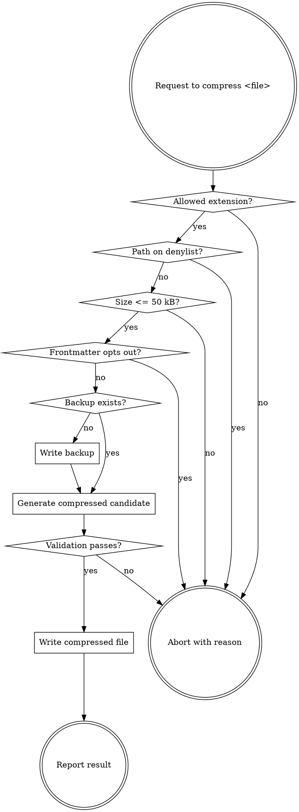

# compress-memory Implementation Plan

> **For Claude:** REQUIRED SUB-SKILL: Use superpowers:executing-plans to implement this plan task-by-task.

**Goal:** Add an 11th plugin, `compress-memory`, that compresses natural-language memory files (`CLAUDE.md`, `docs/planning/STATE.md`, `docs/planning/ROADMAP.md`) while preserving code/URLs/paths/frontmatter/structure byte-exact. Wire it as an opt-in step of `project-orchestration:pause-work`.

**Architecture:** New marketplace plugin following the same shape as the existing 10 plugins (`.claude-plugin/plugin.json` + `skills/<name>/SKILL.md` + supporting reference docs + `NOTICE.md`). Pure-markdown skill — runs in the active Claude conversation, no Python toolchain. Opt-in persisted as `compress_memory: enabled` frontmatter on `ROADMAP.md`; `pause-work` auto-invokes when enabled. Fails graceful (mirrors `sync-github` pattern) — compression failure never blocks pause-work.

**Tech Stack:** Markdown skill files, YAML frontmatter, Claude Code plugin system, git for backup/commit.

**Design doc:** [docs/plans/2026-05-11-compress-memory-design.md](2026-05-11-compress-memory-design.md)

**Inspiration:** [JuliusBrussee/caveman](https://github.com/JuliusBrussee/caveman) caveman-compress (MIT). No files copied — patterns adapted only. caveman-shrink intentionally not bundled (it is an MCP middleware, not a skill).

---

## Task ordering rationale

Tasks 1-5 build the new plugin in isolation (works manually via `/compress-memory <file>` once Task 5 commits). Task 6 makes it discoverable in Claude Code. Task 7 propagates to all other harnesses. Tasks 8-11 wire the opt-in and auto-invocation into project-orchestration. Task 12 documents everything in the top-level README. Task 13 runs manual smoke verification. Each task is independently committable; the plugin works in degraded form after each milestone.

---

### Task 1: Create plugin directory structure and metadata

**Files:**
- Create: `plugins/compress-memory/.claude-plugin/plugin.json`
- Create directories: `plugins/compress-memory/.claude-plugin/`, `plugins/compress-memory/skills/compress-memory/`

**Step 1: Create the directory structure**

```bash
mkdir -p plugins/compress-memory/.claude-plugin
mkdir -p plugins/compress-memory/skills/compress-memory
```

**Step 2: Write plugin.json**

Create `plugins/compress-memory/.claude-plugin/plugin.json`:

```json
{
  "name": "compress-memory",
  "description": "Compress natural-language memory files (CLAUDE.md, STATE.md, ROADMAP.md, project notes) to save input tokens replayed every session. Preserves code blocks, URLs, file paths, frontmatter, headings, tables, and list structure byte-exact. Backs up the original to FILE.original.md before each compression. Refuses to operate on downstream-consumed plan artifacts. Opt-in via project-orchestration plan-roadmap; auto-invoked by pause-work.",
  "author": {
    "name": "Marcel Roozekrans"
  }
}
```

**Step 3: Verify file exists**

Read `plugins/compress-memory/.claude-plugin/plugin.json` and confirm JSON parses and contains the `name` field equal to `compress-memory`.

**Step 4: Commit**

```bash
git add plugins/compress-memory/.claude-plugin/plugin.json
git commit -m "feat(compress-memory): add plugin metadata"
```

---

### Task 2: Write compression-rules.md

**Files:**
- Create: `plugins/compress-memory/skills/compress-memory/compression-rules.md`

**Step 1: Write the reference document**

Create `plugins/compress-memory/skills/compress-memory/compression-rules.md` with the following content. Style: follow the pattern of `code-quality-rules.md` and `commit-hygiene-rules.md` — section headers, examples, and "what to do / what not to do" prose.

````markdown
# Compression Rules

This document defines the compression rules applied by the compress-memory skill. The rules trade prose fluency for token density while preserving every byte that a downstream skill or human might key off.

---

## 1. Drop

Strip these patterns from prose entirely:

### Articles

- `a`, `an`, `the` — when removing does not change meaning. Keep when removal would create ambiguity ("the API" stays if "API" alone is ambiguous in context).

### Filler adverbs

- `just`, `really`, `basically`, `actually`, `simply`, `essentially`, `generally`, `literally`

### Pleasantries

- `sure`, `certainly`, `of course`, `happy to`, `I'd recommend`, `feel free to`

### Hedging phrases

- `it might be worth`, `you could consider`, `it would be good to`, `you may want to`, `perhaps`, `arguably`

### Connective fluff

- `however`, `furthermore`, `additionally`, `in addition`, `moreover`, `that being said`

### Imperative softeners

Drop the softener; keep the action.

| Verbose | Compressed |
|---|---|
| `You should always run tests before commit` | `Run tests before commit` |
| `Make sure to validate input` | `Validate input` |
| `Remember to update the changelog` | `Update changelog` |

---

## 2. Replace

Substitute longer phrasing with shorter equivalents that preserve meaning exactly.

| Verbose | Compressed |
|---|---|
| `in order to` | `to` |
| `make sure to` | `ensure` |
| `the reason is because` | `because` |
| `utilize` | `use` |
| `implement a solution for` | `fix` |
| `extensive` | `big` |
| `at this point in time` | `now` |
| `due to the fact that` | `because` |
| `a large number of` | `many` |

---

## 3. Preserve byte-exact (NEVER modify)

The following constructs must appear in the compressed output byte-equal to the input. Any character difference is a validation failure.

- **Fenced code blocks** — everything between ``` fences (inclusive of the fence lines themselves).
- **Indented code blocks** — any block of 4-space-indented lines that the markdown renderer would treat as code.
- **Inline code spans** — text inside `` ` `` backticks.
- **URLs and markdown links** — `https://...`, `[text](url)`, autolinks, image links.
- **File paths** — `/src/foo.py`, `./config.yaml`, `~/.claude/`, Windows paths with backslashes.
- **Shell commands** — `npm install`, `git commit -m "..."`, `docker build .`, etc., when written as inline code or in fenced blocks.
- **Environment variables** — `$HOME`, `$env:NODE_ENV`, `%USERPROFILE%`.
- **Version numbers, dates, numeric values** — `v1.2.3`, `2026-05-11`, `4096`.
- **Frontmatter blocks** — YAML between `---` fences at file start.
- **Markdown table structure** — every pipe `|` and alignment row stays. Cell text inside tables follows the same drop/replace/preserve rules.
- **Heading hierarchy** — `#`, `##`, `###` levels and exact heading text.
- **List item markers and nesting depth** — `- `, `1. `, indent level all preserved.

### Critical rule

Anything inside ``` ... ``` must be copied EXACTLY. Do not:

- remove comments
- collapse spacing
- reorder lines
- shorten commands
- "improve" anything

Inline code (`` `...` ``) must be preserved EXACTLY. Do not modify anything inside backticks.

If a section mixes prose and code:

- Treat code blocks as read-only regions.
- Compress only the prose around them.
- Do not merge sections across code block boundaries.

---

## 4. Compress

Where prose remains after Drop and Replace:

- **Use short synonyms.** `big` not `extensive`; `fix` not `implement a solution for`; `use` not `utilize`.
- **Fragments are OK.** `Run tests before commit` not `You should always run tests before committing`.
- **Merge redundant bullets** that say the same thing differently.
- **Keep one example** where multiple examples show the same pattern.

---

## 5. Worked examples

**Original:**

> You should always make sure to run the test suite before pushing any changes to the main branch. This is important because it helps catch bugs early and prevents broken builds from being deployed to production.

**Compressed:**

> Run tests before push to main. Catch bugs early, prevent broken prod deploys.

---

**Original:**

> The application uses a microservices architecture with the following components. The API gateway handles all incoming requests and routes them to the appropriate service. The authentication service is responsible for managing user sessions and JWT tokens.

**Compressed:**

> Microservices architecture. API gateway routes incoming requests to services. Auth service manages user sessions + JWT tokens.

---

**Original (mixed prose + code):**

> First, you should run the following command to install the dependencies:
>
> ```bash
> npm install
> ```
>
> Then, make sure to start the development server with this command:
>
> ```bash
> npm run dev
> ```

**Compressed:**

> Install deps:
>
> ```bash
> npm install
> ```
>
> Start dev server:
>
> ```bash
> npm run dev
> ```

The fenced blocks are byte-equal. Only prose changed.
````

**Step 2: Verify file**

Read `plugins/compress-memory/skills/compress-memory/compression-rules.md` and confirm the five top-level sections (Drop, Replace, Preserve byte-exact, Compress, Worked examples) are present.

**Step 3: Commit**

```bash
git add plugins/compress-memory/skills/compress-memory/compression-rules.md
git commit -m "feat(compress-memory): add compression-rules reference"
```

---

### Task 3: Write safety-rules.md

**Files:**
- Create: `plugins/compress-memory/skills/compress-memory/safety-rules.md`

**Step 1: Write the reference document**

Create `plugins/compress-memory/skills/compress-memory/safety-rules.md`:

````markdown
# Safety Rules

This document defines the safety guarantees the compress-memory skill MUST enforce. Every guarantee is a hard invariant — when in conflict with terseness or convenience, safety wins.

---

## 1. Denylist — hard-coded, non-configurable

The following path patterns are NEVER compressible. The denylist lives in this skill body, not in user config, because these files are *contracts between skills*. Making them optional-to-protect invites footguns.

| Pattern | Why protected |
|---|---|
| `docs/plans/**` | Plan documents read by `executing-plans`, `subagent-driven-development` |
| `*ui-contract*` | UI design contracts audited by `ui-workflow:ui-review` against literal criteria text |
| `*impact-analysis*` | Refactor impact analyses with nuanced risk register prose |
| `*-design.md` | Brainstorm design documents consumed by `writing-plans` |
| `*-review-*.md` | Pre-push review reports and UI review audits |
| `*.original.md` | Backup files — never overwrite, never compress |
| `MILESTONE.md` | Rewritten by `new-milestone` / `complete-milestone`, not every pause; compounding case weak |

When asked to compress a denied file, abort with the specific reason:

> "Refusing to compress `<path>`: matches denylist pattern `<pattern>`. These files are contracts between skills and must remain in their original form. Use `compress-memory` on `CLAUDE.md`, `STATE.md`, `ROADMAP.md`, or project notes instead."

---

## 2. Allowed file types

- `.md`
- `.txt`

Any other extension → abort with reason.

---

## 3. Size limit

If the file is larger than 50 kB, abort with:

> "Refusing to compress `<path>`: file size <X> kB exceeds the 50 kB memory-file threshold. Files this large are usually not natural-language memory — they are logs, exports, or generated content. Compression rules assume short-form prose."

---

## 4. Per-file opt-out

If the file's frontmatter contains either of these fields with value `skip`:

```yaml
---
compress: skip
---
```

or

```yaml
---
compress_memory: skip
---
```

abort with:

> "Skipping `<path>`: frontmatter explicitly opts out (`compress: skip` or `compress_memory: skip`)."

---

## 5. Backup invariant

Before any rewrite of `<file>.md`:

1. If `<file>.original.md` does NOT exist → copy `<file>.md` to `<file>.original.md`. This becomes the pristine baseline.
2. If `<file>.original.md` ALREADY exists → leave it untouched. Do NOT overwrite. The first backup is the canonical one.

If the backup write fails (permissions, disk full), abort WITHOUT modifying the original. The original file must never be modified without a successful backup in place.

To re-baseline after intentional edits, the user manually deletes `<file>.original.md` and runs compression again.

---

## 6. Validation — structural diff, not LLM-judged

After producing the compressed candidate (but BEFORE writing it to disk), run all of the following mechanical checks on the input-vs-output pair. Any failure → abort, restore from backup, report which check failed.

| Check | Rule |
|---|---|
| Fenced code blocks | Same count, each block byte-equal between input and output |
| Inline code spans | Same count |
| URLs (full set) | The set of URLs in the output must equal the set in the input — no additions, no removals |
| Markdown headings | Same count, same exact heading text, same order |
| Frontmatter block | Byte-equal to input (or absent in both) |
| Markdown tables | Same count of table blocks, same column count per table |

Validation is purely mechanical — counts and byte-equality. There is NO "is this still semantically equivalent?" LLM judgment in this loop. Mechanical checks are deterministic and auditable; semantic judgment is not.

---

## 7. Failure mode = restore, never partial

If validation fails:

1. Do NOT write the compressed candidate.
2. Confirm the original file on disk still matches the backup (it should — we haven't written anything yet).
3. Report the specific failure to the user.

If invoked from `pause-work` (auto mode), report the failure to the orchestrating skill which logs it and continues with the uncompressed file. Never block the parent skill on a compression failure.

---

## 8. Report after success

After a successful compression and write, report to the user:

> Compressed `<path>`:
> - Before: <X> bytes
> - After: <Y> bytes
> - Saved: <Z>% (<W> tokens approx)
> - Backup: `<path>.original.md`
````

**Step 2: Verify file**

Read `plugins/compress-memory/skills/compress-memory/safety-rules.md` and confirm all 8 numbered sections are present.

**Step 3: Commit**

```bash
git add plugins/compress-memory/skills/compress-memory/safety-rules.md
git commit -m "feat(compress-memory): add safety-rules reference"
```

---

### Task 4: Write NOTICE.md

**Files:**
- Create: `plugins/compress-memory/skills/compress-memory/NOTICE.md`

**Step 1: Write the attribution document**

Create `plugins/compress-memory/skills/compress-memory/NOTICE.md`:

```markdown
# compress-memory — Attribution

The compression-rules approach in this skill is inspired by the `caveman-compress` sub-skill from [JuliusBrussee/caveman](https://github.com/JuliusBrussee/caveman) (MIT License).

## What was adapted

The rule set is adapted from caveman:

- Drop articles / filler / pleasantries / hedging / connective fluff
- Replace verbose phrasing with shorter equivalents
- Preserve code blocks, URLs, file paths, commands, env vars, frontmatter byte-exact
- Preserve markdown structure (headings, tables, lists)
- Back up original to `<file>.original.md` before overwrite

## What is different here

- **No Python toolchain.** caveman drives a separate Python implementation (`compress.py`, `detect.py`, `validate.py`, `cli.py`) that calls the Claude API itself. This skill runs in the active Claude Code conversation as pure markdown — no Python dependency, no second API key, no extra runtime.
- **Denylist for downstream-consumed artifacts.** caveman has no per-file denylist; this skill refuses to operate on `docs/plans/*`, UI contracts, impact analyses, design documents, and review reports because those files are contracts between skills in the superpowers-extensions suite. Compressing them would break downstream consumers.
- **project-orchestration integration.** This skill is opt-in via a `compress_memory` frontmatter flag on `ROADMAP.md` set during `plan-roadmap`, and auto-invoked by `pause-work` after writing `STATE.md`. caveman has no comparable lifecycle integration.

No source files were copied from caveman. The rule set is reimplemented as markdown content that codifies the same compression patterns.

## License

caveman is licensed under the MIT License. superpowers-extensions is also MIT-licensed. The two licenses are fully compatible.

```text
MIT License

Copyright (c) 2025 Julius Brussee

Permission is hereby granted, free of charge, to any person obtaining a copy
of this software and associated documentation files (the "Software"), to deal
in the Software without restriction, including without limitation the rights
to use, copy, modify, merge, publish, distribute, sublicense, and/or sell
copies of the Software, and to permit persons to whom the Software is
furnished to do so, subject to the following conditions:

The above copyright notice and this permission notice shall be included in all
copies or substantial portions of the Software.

THE SOFTWARE IS PROVIDED "AS IS", WITHOUT WARRANTY OF ANY KIND, EXPRESS OR
IMPLIED, INCLUDING BUT NOT LIMITED TO THE WARRANTIES OF MERCHANTABILITY,
FITNESS FOR A PARTICULAR PURPOSE AND NONINFRINGEMENT. IN NO EVENT SHALL THE
AUTHORS OR COPYRIGHT HOLDERS BE LIABLE FOR ANY CLAIM, DAMAGES OR OTHER
LIABILITY, WHETHER IN AN ACTION OF CONTRACT, TORT OR OTHERWISE, ARISING FROM,
OUT OF OR IN CONNECTION WITH THE SOFTWARE OR THE USE OR OTHER DEALINGS IN THE
SOFTWARE.
```

## See also

caveman ships a related component, `caveman-shrink` — an MCP middleware that compresses tool descriptions on startup. It is intentionally NOT bundled in superpowers-extensions because it is runtime infrastructure (an MCP server), not a Claude Code skill. Users who want it can install it directly from npm: `npm install -g caveman-shrink`. The README links to it under the Ecosystem section.
```

**Step 2: Verify file**

Read the file and confirm sections "What was adapted", "What is different here", "License", and "See also" are all present.

**Step 3: Commit**

```bash
git add plugins/compress-memory/skills/compress-memory/NOTICE.md
git commit -m "feat(compress-memory): add NOTICE attributing caveman"
```

---

### Task 5: Write SKILL.md — the orchestrator

**Files:**
- Create: `plugins/compress-memory/skills/compress-memory/SKILL.md`

**Step 1: Write the skill body**

Create `plugins/compress-memory/skills/compress-memory/SKILL.md`. This is the entry point Claude reads when the skill activates. It MUST start with YAML frontmatter using the same format as other plugins in this repo (see [plugins/project-orchestration/skills/project-orchestration/SKILL.md](../../plugins/project-orchestration/skills/project-orchestration/SKILL.md) for the canonical example):

````markdown
---
name: compress-memory
description: >
  Use when the user asks to compress a natural-language memory file (CLAUDE.md, STATE.md,
  ROADMAP.md, project notes) to save input tokens. Preserves code blocks, URLs, file paths,
  frontmatter, headings, tables, and list structure byte-exact. Backs up the original to
  FILE.original.md before each compression. Refuses to operate on downstream-consumed
  artifacts (plan documents, UI contracts, impact analyses, design documents, review reports).
  Triggers: "/compress-memory <path>", "compress STATE.md", "shrink CLAUDE.md", "compact this
  memory file". Also auto-invoked by project-orchestration:pause-work when
  ROADMAP.md frontmatter contains compress_memory: enabled.
---

# Compress Memory

## Purpose

Compress natural-language memory files into a terser form that preserves every byte a downstream consumer (skill or human) might key off. Reduces input tokens replayed every Claude Code session.

This is **input token compression**. Caveman-style output speech is explicitly NOT in scope (it would fight every skill in this suite that produces structured artifacts). See `NOTICE.md` for the relationship to caveman-compress.

## When to Use

### Explicit triggers

- `/compress-memory <filepath>` slash command
- Natural language: "compress STATE.md", "shrink CLAUDE.md", "compact this memory file"

### Automatic trigger

- `project-orchestration:pause-work` invokes this skill on `docs/planning/STATE.md` (and `ROADMAP.md` if dirty) when `docs/planning/ROADMAP.md` frontmatter contains `compress_memory: enabled`.

## When NOT to Use

This skill REFUSES the following files (see [safety-rules.md](safety-rules.md) for the full denylist):

- Any file under `docs/plans/` — these are plan documents read literally by downstream skills
- `*-design.md`, `*-impact-analysis*`, `*ui-contract*`, `*-review-*.md` — contracts between skills
- `MILESTONE.md` — rewritten on milestone transitions, not pause-work
- `*.original.md` — backup files
- Anything not `.md` or `.txt`
- Files larger than 50 kB
- Files with `compress: skip` or `compress_memory: skip` in their frontmatter

When asked to compress a denied file, refuse with the specific reason. Do not modify the file.

## Process

### Step 1 — Validate the file

1. Resolve the file path. If a relative path was given, resolve against the project root.
2. Check the extension is `.md` or `.txt`. If not → abort with reason.
3. Check the path against the denylist in [safety-rules.md](safety-rules.md). If denied → abort with the denylist pattern that matched and the user-facing message from safety-rules.md.
4. Read the file. If size > 50 kB → abort with reason.
5. If the file has YAML frontmatter and the frontmatter contains `compress: skip` or `compress_memory: skip` → abort with the per-file opt-out message.

### Step 2 — Back up the original

1. Compute backup path: `<filepath>.original.md` (replace the extension; for a file already named `*.md`, append `.original` before `.md` → `STATE.md` → `STATE.original.md`).
2. If the backup file already exists → leave it untouched. The first backup is canonical.
3. If the backup file does NOT exist → write the original content to it before any modification of the source file.
4. If the backup write fails for any reason → abort WITHOUT modifying the original. Report the failure.

### Step 3 — Generate the compressed candidate

Apply the rules in [compression-rules.md](compression-rules.md):

1. Drop: articles, filler adverbs, pleasantries, hedging, connective fluff, imperative softeners.
2. Replace: verbose phrasing with shorter equivalents from the table.
3. Preserve byte-exact: fenced code blocks, indented code blocks, inline code spans, URLs and markdown links, file paths, shell commands, environment variables, version numbers, dates, frontmatter blocks, markdown tables (structure + cell text follows the same rules), headings (level + exact text), list nesting.

Apply rules to PROSE ONLY. Treat code blocks as read-only regions.

### Step 4 — Validate the compressed candidate

Run all of the following mechanical checks BEFORE writing the candidate to disk. Each check compares the candidate against the original input.

1. **Fenced code blocks** — extract every fenced block from input and from candidate. Counts must match. Each block must be byte-equal.
2. **Inline code spans** — count must match.
3. **URLs** — extract the full set of URLs from input and from candidate. Sets must be equal (no additions, no removals).
4. **Markdown headings** — extract every heading line. Count, exact text, and order must match.
5. **Frontmatter** — if input has a frontmatter block, candidate must have a byte-equal frontmatter block. If input has no frontmatter, candidate must also have none.
6. **Markdown tables** — count of table blocks must match; column count per table must match.

If ANY check fails:

- Do NOT write the candidate to disk.
- Confirm the original file still matches the backup (it should — we haven't written anything).
- Report the specific failure to the user.
- If invoked from `pause-work`, return failure to the parent so it can log and continue with the uncompressed file.

### Step 5 — Write the compressed file

If all validation checks pass:

1. Write the compressed candidate over the original file path using the `Write` tool.
2. Verify the write succeeded by re-reading the file and confirming size matches the candidate.
3. Report to the user:

   > Compressed `<path>`:
   > - Before: `<X>` bytes
   > - After: `<Y>` bytes
   > - Saved: `<Z>%`
   > - Backup: `<path>.original.md`

## Decision Tree



## Common Mistakes

1. **Modifying code inside fenced blocks** — even "obvious cleanups" inside ``` ... ``` are forbidden. Treat code blocks as read-only.
2. **Compressing tables by deleting columns** — table structure (pipe layout, alignment row, column count) is preserved. Only cell prose follows drop/replace rules.
3. **"Just one URL changed" — that's a failure** — URL set equality is strict. A typo'd URL is a validation failure, not a successful compression.
4. **Re-overwriting `*.original.md`** — the first backup is canonical. Do not re-create the backup on subsequent compressions; the user wants to be able to recover the pristine version.
5. **Operating on a denylisted file because the user asked** — denylist is hard-coded for a reason. Refuse, explain why, point at the safer files.

## References

- [compression-rules.md](compression-rules.md) — the drop/replace/preserve rules in detail
- [safety-rules.md](safety-rules.md) — denylist, backup invariant, validation
- [NOTICE.md](NOTICE.md) — attribution to caveman (MIT)
````

**Step 2: Verify the file**

Read `plugins/compress-memory/skills/compress-memory/SKILL.md` and confirm:

- YAML frontmatter is present with `name: compress-memory` and a multi-line `description`.
- Sections present: Purpose, When to Use, When NOT to Use, Process (with Steps 1-5), Decision Tree, Common Mistakes, References.
- All three reference files (`compression-rules.md`, `safety-rules.md`, `NOTICE.md`) are linked.

**Step 3: Commit**

```bash
git add plugins/compress-memory/skills/compress-memory/SKILL.md
git commit -m "feat(compress-memory): add SKILL.md orchestrator"
```

---

### Task 6: Register in Claude Code marketplace

**Files:**
- Modify: `.claude-plugin/marketplace.json`

**Step 1: Read the current marketplace.json**

Read `.claude-plugin/marketplace.json` and locate the `plugins[]` array. Note the schema used by existing entries (name, description, version, author, source, category).

**Step 2: Add the 11th entry**

After the `squad` entry in `plugins[]`, add:

```json
{
  "name": "compress-memory",
  "description": "Compress natural-language memory files (CLAUDE.md, STATE.md, ROADMAP.md, project notes) to save input tokens replayed every session. Preserves code blocks, URLs, file paths, frontmatter, headings, tables, and list structure byte-exact. Refuses to operate on downstream-consumed plan artifacts. Opt-in via project-orchestration plan-roadmap; auto-invoked by pause-work.",
  "version": "1.17.0",
  "author": {
    "name": "Marcel Roozekrans"
  },
  "source": "./plugins/compress-memory",
  "category": "workflow"
}
```

Use the `Edit` tool, adding the comma after the `squad` entry's closing brace and inserting the new object before the array's closing `]`.

**Step 3: Verify**

Read `.claude-plugin/marketplace.json` and confirm:
- The JSON parses (no trailing commas, balanced braces).
- The `plugins[]` array now has 11 entries.
- The `compress-memory` entry has `source: "./plugins/compress-memory"`.

```bash
# Quick syntax check
node -e "JSON.parse(require('fs').readFileSync('.claude-plugin/marketplace.json', 'utf8'))"
```

Expected: command exits 0 with no output. If it errors, fix the JSON.

**Step 4: Commit**

```bash
git add .claude-plugin/marketplace.json
git commit -m "feat(marketplace): register compress-memory plugin"
```

---

### Task 7: Register in non-Claude harness manifests

**Files:**
- Modify: `.opencode/plugins/superpowers-extensions.js`
- Modify: `GEMINI.md`
- Modify: `.cursor-plugin/plugin.json` (only if it lists plugins individually — confirm by reading first)
- Modify: `.codex-plugin/plugin.json` (only if it lists plugins individually — confirm by reading first)
- Modify: `.codex/INSTALL.md`
- Modify: `.copilot-cli/INSTALL.md`
- Modify: `gemini-extension.json` (only the `keywords` array; main config is harness-agnostic and stays untouched)

**Step 1: Update OpenCode plugin**

In `.opencode/plugins/superpowers-extensions.js`, find the `PLUGINS` array (currently 10 entries). Add `'compress-memory'` to the end:

```javascript
const PLUGINS = [
  'regression-test',
  'pre-push-review',
  'refactor-analysis',
  'decision-tracker',
  'roslyn-codelens-integration',
  'memorylens-integration',
  'project-orchestration',
  'ui-workflow',
  'ui-design-system',
  'squad',
  'compress-memory'
];
```

Update the JSDoc comment that says "ten skills" → "eleven skills".

**Step 2: Update Gemini context file**

In `GEMINI.md`, add a new line at the end of the existing list of `@./plugins/.../SKILL.md` imports:

```text
@./plugins/compress-memory/skills/compress-memory/SKILL.md
```

**Step 3: Update Cursor manifest (if applicable)**

Read `.cursor-plugin/plugin.json`. If it lists individual plugin paths, add a `compress-memory` entry. If it uses a glob/directory pointing at `./plugins/` as a whole (like the Claude `gemini-extension.json` does with `"skills": "./plugins/"`), no change needed — note this in the verify step.

**Step 4: Update Codex manifest (if applicable)**

Read `.codex-plugin/plugin.json`. Same logic as cursor — if it lists individual plugins, add an entry; if it's a directory pointer, no change.

**Step 5: Update Codex INSTALL.md**

In `.codex/INSTALL.md`, find the section that lists per-plugin symlink-clone instructions for the existing 10 plugins. Add an 11th block for `compress-memory` mirroring the format of the existing entries.

**Step 6: Update Copilot CLI INSTALL.md**

In `.copilot-cli/INSTALL.md`, find the per-plugin install lines (`copilot plugin install ...`). Add a line for `compress-memory` mirroring the format of the existing entries.

**Step 7: Update gemini-extension.json keywords**

In `gemini-extension.json`, add `"compress-memory"` to the `keywords` array. The `name`/`description`/`version`/`contextFileName` fields stay unchanged — they describe the whole suite.

Also bump the description's plugin enumeration to include compress-memory if it lists them by name.

**Step 8: Verify**

For each modified file, re-read and confirm:
- `.opencode/plugins/superpowers-extensions.js` — `PLUGINS` array has 11 entries
- `GEMINI.md` — 11 `@./plugins/.../SKILL.md` lines
- `.codex/INSTALL.md` — install block for `compress-memory` present
- `.copilot-cli/INSTALL.md` — install line for `compress-memory` present
- `gemini-extension.json` — `keywords` includes `compress-memory`

**Step 9: Commit**

```bash
git add .opencode/plugins/superpowers-extensions.js GEMINI.md .codex/INSTALL.md .copilot-cli/INSTALL.md gemini-extension.json
# Plus any of .cursor-plugin/plugin.json or .codex-plugin/plugin.json that needed changes
git commit -m "feat(manifests): register compress-memory across all harness manifests"
```

---

### Task 8: Document `compress_memory` frontmatter in state-files.md

**Files:**
- Modify: `plugins/project-orchestration/skills/project-orchestration/state-files.md`

**Step 1: Read the file**

Read `plugins/project-orchestration/skills/project-orchestration/state-files.md` and find the `## ROADMAP.md` section. It currently shows the canonical structure of ROADMAP.md without any frontmatter.

**Step 2: Add a new subsection documenting the frontmatter field**

After the existing "Canonical syntax — exact bracket and heading rules" subsection of `## ROADMAP.md`, add a new subsection:

````markdown
### Optional frontmatter — `compress_memory`

`ROADMAP.md` may start with a YAML frontmatter block declaring per-project preferences. The only field currently defined is `compress_memory`, used by the `compress-memory` skill:

```yaml
---
compress_memory: enabled   # or: disabled
---
```

| Value | Behavior |
|---|---|
| `enabled` | `pause-work` invokes `compress-memory` on `STATE.md` after writing it, and on `ROADMAP.md` itself if it has changed since the last commit. Compression failures are logged and do not block `pause-work` (mirrors the `sync-github` graceful-failure pattern). |
| `disabled` | `pause-work` skips compression. Users can still invoke `/compress-memory <file>` manually. |
| (field absent) | Treated as `disabled` — backwards compatible default. |

The field is set during `plan-roadmap` via an opt-in question, but may be edited by hand at any time. Flipping `enabled` → `disabled` stops further auto-compression; existing compressed files stay compressed (`*.original.md` backups remain on disk for recovery).

The `compress_memory` field is the only field; do not invent additional keys here without updating this document and the `compress-memory` skill's safety rules.
````

**Step 3: Verify**

Read the file back and confirm the new subsection exists with the table of three values.

**Step 4: Commit**

```bash
git add plugins/project-orchestration/skills/project-orchestration/state-files.md
git commit -m "docs(project-orchestration): document compress_memory frontmatter on ROADMAP.md"
```

---

### Task 9: Wire opt-in question into `plan-roadmap`

**Files:**
- Modify: `plugins/project-orchestration/skills/project-orchestration/SKILL.md` (the `plan-roadmap` section starting at line ~738)

**Step 1: Locate the plan-roadmap section**

Read [plugins/project-orchestration/skills/project-orchestration/SKILL.md](../../plugins/project-orchestration/skills/project-orchestration/SKILL.md) around lines 738-790. Identify steps 1-9 of `plan-roadmap`. Step 4 currently writes `ROADMAP.md`; step 5 VERIFY-reads it; step 6 writes `MILESTONE.md`.

**Step 2: Insert the opt-in question between steps 3 and 4**

The current step 3 ends with "the brainstorm did NOT complete at roadmap scope". After it, before the current step 4 ("Use the `Write` tool to create `docs/planning/ROADMAP.md`"), insert a new step. Renumber subsequent steps (current 4 → 5, 5 → 6, 6 → 7, 7 → 8, 8 → 9, 9 → 10).

Insert this content:

````markdown
4. **Ask the compress-memory opt-in question.** If the `compress-memory` plugin is installed (check for `plugins/compress-memory/skills/compress-memory/SKILL.md` in the active marketplace), ask:

   > **Enable memory-file compression for this project?**
   >
   > When enabled, `pause-work` automatically compresses `STATE.md` and `ROADMAP.md` after writing them. Saves ~40-50% input tokens every time those files are read back (every `resume-work`, every `progress`, every session start). Code, URLs, paths, headings, and tables preserved byte-exact. Original files backed up as `*.original.md` before each compression.
   >
   > Trade-off: prose nuance gets terser. If you write long-form rationale in STATE.md notes, you may prefer to keep it readable.
   >
   > `(y/N)` — opt-out by default.

   Record the answer (`enabled` if yes, `disabled` if no or skipped). This value goes into the `compress_memory` frontmatter field on `ROADMAP.md` in the next step.

   If `compress-memory` is NOT installed, skip this question and treat the answer as absent (no frontmatter written). The user can install the plugin later and add the field manually.
````

**Step 3: Update the ROADMAP.md write step**

The renumbered step 5 (originally step 4) currently says:

```text
5. **Use the `Write` tool** to create `docs/planning/ROADMAP.md` from the design spec — first milestone with `status: active`, all others with `status: pending`. Format per [state-files.md](state-files.md).
```

Update it to:

```text
5. **Use the `Write` tool** to create `docs/planning/ROADMAP.md` from the design spec.
   - If the user answered the opt-in question (step 4), prepend the YAML frontmatter block to the file:
     ```yaml
     ---
     compress_memory: enabled
     ---
     ```
     (or `disabled` per the user's answer)
   - First milestone with `status: active`, all others with `status: pending`. Format per [state-files.md](state-files.md).
```

**Step 4: Update the VERIFY step**

The renumbered step 6 (originally step 5) should mention the frontmatter in its checks. Update its VERIFY criteria to include: "(d) if the opt-in question was asked, frontmatter `compress_memory` field is present with value `enabled` or `disabled`."

**Step 5: Verify the edit**

Read the SKILL.md `plan-roadmap` section back and confirm:
- New step 4 with the opt-in question is present
- Steps 5-10 are renumbered correctly
- Step 5 mentions writing the frontmatter conditionally
- Step 6 VERIFY mentions the frontmatter check

Grep-test: `grep -n "compress_memory" plugins/project-orchestration/skills/project-orchestration/SKILL.md` should show at least 3 matches inside the plan-roadmap section.

**Step 6: Commit**

```bash
git add plugins/project-orchestration/skills/project-orchestration/SKILL.md
git commit -m "feat(project-orchestration): add compress-memory opt-in to plan-roadmap"
```

---

### Task 10: Wire auto-compression into `pause-work`

**Files:**
- Modify: `plugins/project-orchestration/skills/project-orchestration/SKILL.md` (the `pause-work` section starting at line ~252)

**Step 1: Locate the pause-work section**

Read [plugins/project-orchestration/skills/project-orchestration/SKILL.md](../../plugins/project-orchestration/skills/project-orchestration/SKILL.md) around lines 252-275. Identify the numbered Process steps. Currently:

- Steps 1-3: identify position/decisions/next step
- Step 4: Write `STATE.md`
- Step 5: VERIFY STATE.md
- Step 6: `git add STATE.md && git commit`
- Step 7: Squad sync
- Step 8: Decision-tracker sync
- Step 9: GitHub sync
- Step 10: Announce

**Step 2: Insert the compression step between steps 5 and 6**

After the VERIFY step (current step 5), before the git commit (current step 6), insert a new step. Renumber steps 6 → 7, 7 → 8, 8 → 9, 9 → 10, 10 → 11.

Insert this content:

````markdown
6. **Compress state files (if enabled).** Read `docs/planning/ROADMAP.md` and check whether its YAML frontmatter contains `compress_memory: enabled`.

   - If `enabled`: invoke the `compress-memory` skill on `docs/planning/STATE.md`. Then, if `git diff --quiet HEAD -- docs/planning/ROADMAP.md` exits non-zero (i.e. ROADMAP.md has changed since the last commit), also invoke `compress-memory` on `docs/planning/ROADMAP.md`.
   - If `disabled`, absent, or the file has no frontmatter: skip compression entirely.
   - If `compress-memory` is not installed: skip compression entirely (treat the field as absent).

   **Graceful failure (matches the `sync-github` pattern):** if `compress-memory` reports a validation failure or any other error, log the failure to the user, leave the uncompressed file on disk, and continue with the remaining `pause-work` steps. Compression failure must NEVER prevent state files from being written, committed, or synced. Local state is the source of truth and must remain writable even when compression breaks.
````

**Step 3: Update the git commit step**

The renumbered step 7 (originally step 6) should include the `.original.md` backup files in the commit when compression ran. Update the commit line to:

```bash
git add docs/planning/STATE.md docs/planning/STATE.original.md docs/planning/ROADMAP.md docs/planning/ROADMAP.original.md 2>/dev/null
git add docs/planning/STATE.md docs/planning/ROADMAP.md
git commit -m "chore(state): pause-work — phase N.M, last task: <description>"
```

The first line is "best-effort" (the `2>/dev/null` swallows errors when the `.original.md` files don't exist — compression was disabled or ROADMAP.md wasn't recompressed this time). The second line ensures the canonical state files are always staged.

Actually, simpler: replace the `git add` line with:

```bash
git add docs/planning/
```

This stages everything in `docs/planning/`, including any `*.original.md` files written by the compression step. The trade-off is that `git add docs/planning/` is broader than the original — but `docs/planning/` is the orchestration state directory and adding everything in it is the intended scope.

**Step 4: Update the .gitignore consideration (optional, no change required)**

Add a note in this same section that users who don't want to commit `.original.md` backups can add them to `.gitignore`:

```text
# .gitignore — opt out of committing backups
docs/planning/*.original.md
```

This is a docs note, not a behavior change. Some users will want the backups in git for cross-machine recovery; others will want them local-only.

**Step 5: Verify**

Read the pause-work section back and confirm:
- New step 6 about compression is present
- Renumbered steps 7-11 are in order
- The graceful-failure clause matches the `sync-github` pattern wording
- `git add docs/planning/` (or the explicit two-line equivalent) is used in the commit step
- The optional `.gitignore` note is present

**Step 6: Commit**

```bash
git add plugins/project-orchestration/skills/project-orchestration/SKILL.md
git commit -m "feat(project-orchestration): auto-compress STATE/ROADMAP in pause-work when enabled"
```

---

### Task 11: Add `resume-work` compatibility note

**Files:**
- Modify: `plugins/project-orchestration/skills/project-orchestration/SKILL.md` (the `resume-work` section starting at line ~279)

**Step 1: Locate the resume-work section**

Find the `## resume-work` heading near line 279. Locate the Process steps (currently 1-N reading STATE.md/ROADMAP.md/MILESTONE.md and presenting the handoff).

**Step 2: Insert a note after the existing Process steps**

After the last Process step but before any subsequent heading, add a new subsection:

````markdown
### Compressed state files

If `ROADMAP.md` frontmatter has `compress_memory: enabled`, `STATE.md` and `ROADMAP.md` on disk are in compressed form (written that way by `pause-work`). This is expected — the compression skill preserves frontmatter, headings, tables, and list structure byte-exact, so this skill's parsing of phase status, milestone numbers, and the current position is unchanged.

If a human reader prefers the original prose (for example, when reading the file directly outside Claude Code), the pristine backup is at `docs/planning/STATE.original.md` and `docs/planning/ROADMAP.original.md`. These backups are the first-write originals; subsequent compressions do not overwrite them.

If you encounter a malformed state file that `resume-work` cannot parse — frontmatter missing the `compress_memory` field but the body looks compressed, headings out of order, etc. — fall back to the `*.original.md` backup, report the corruption to the user, and ask whether to re-baseline.
````

**Step 3: Verify**

Read the resume-work section back and confirm the new "Compressed state files" subsection is present.

**Step 4: Commit**

```bash
git add plugins/project-orchestration/skills/project-orchestration/SKILL.md
git commit -m "docs(project-orchestration): note compressed-state-file compatibility in resume-work"
```

---

### Task 12: Update top-level README

**Files:**
- Modify: `README.md`

**Step 1: Read the current README**

Read [README.md](../../README.md). Note the seven edit sites identified in the design doc:

1. Plugin count ("ten skills" → "eleven skills") in the intro paragraph (line ~5) and Installation block
2. Bulleted intro list — insert `compress-memory` bullet between `decision-tracker` and `roslyn-codelens-integration`
3. New `## Compress Memory Skill` section after the Project Orchestration Skill section
4. Installation Option A — add `claude plugin install compress-memory` line
5. Installation Option C — add Windows + macOS/Linux copy commands for the new plugin
6. Project Structure tree — add `compress-memory/` block
7. Ecosystem section — caveman-shrink paragraph
8. Skill Composition table — row for compress-memory

**Step 2: Update plugin count**

Find the intro paragraph (around line 5): `"...providing quality gates, development workflow skills, and project lifecycle management for web application development. It includes ten skills:"`. Replace `ten skills` with `eleven skills`.

Also search for any other occurrences of "ten" or "10" describing the plugin count and update them.

**Step 3: Insert the bulleted intro entry**

In the bulleted list at the top of the README, between the `decision-tracker` bullet and the `roslyn-codelens-integration` bullet, insert:

```markdown
- **compress-memory** -- Compresses natural-language memory files (`CLAUDE.md`, `STATE.md`, `ROADMAP.md`, project notes) to save input tokens replayed every session. Pure-markdown skill — preserves code blocks, URLs, file paths, frontmatter, headings, tables, and list structure byte-exact; backs up the original to `FILE.original.md` before each compression. Opt-in via `project-orchestration:plan-roadmap`; auto-invoked by `pause-work`. Inspired by [caveman-compress](https://github.com/JuliusBrussee/caveman) (MIT) but reimplemented without a Python toolchain.
```

**Step 4: Add the new ## Compress Memory Skill section**

After the `## Project Orchestration Skill` section, before whatever section currently follows it (likely `## UI Workflow Skill`), insert a new section. The section length and depth should match the other skill sections in the README.

````markdown
---

## Compress Memory Skill

The compress-memory skill compresses natural-language memory files to save input tokens replayed every Claude Code session, while preserving every byte a downstream consumer (skill or human) might key off.

This is **input token compression**. Output-style "caveman speech" is explicitly not in scope — it would fight every other skill in this suite that produces structured artifacts.

### What It Does

When invoked, the skill:

1. **Validates** the file is compressible (allowed extension, not on denylist, under 50 kB, no per-file `compress: skip` opt-out)
2. **Backs up** the original to `<file>.original.md` (only on the first compression — subsequent runs leave the backup untouched)
3. **Compresses** the prose per the drop / replace rules — strips articles, filler, pleasantries, hedging, connective fluff; replaces verbose phrasing with shorter equivalents
4. **Preserves byte-exact:** fenced code blocks, indented code blocks, inline code spans, URLs and markdown links, file paths, shell commands, environment variables, version numbers, dates, frontmatter blocks, markdown tables, headings, and list nesting
5. **Validates structurally** — counts of code blocks, headings, URLs, tables must match input; frontmatter byte-equal; code blocks byte-equal
6. **Restores from backup** if validation fails (no partial corruption)
7. **Reports** size delta to the user

### Denylist (hard-coded, not configurable)

The skill REFUSES to operate on:

- `docs/plans/**` — plan documents read literally by `executing-plans`, `subagent-driven-development`
- `*ui-contract*` — UI contracts audited by `ui-workflow:ui-review`
- `*impact-analysis*` — refactor impact analyses with nuanced risk register prose
- `*-design.md` — brainstorm design documents
- `*-review-*.md` — pre-push review reports and UI review audits
- `MILESTONE.md` — rewritten only on milestone transitions
- `*.original.md` — backup files (never compressed, never overwritten)
- Anything not `.md` or `.txt`, or larger than 50 kB

These files are **contracts between skills**; compressing them would break downstream consumers.

### Opt-in via project-orchestration

The skill is opt-in. During `project-orchestration:plan-roadmap`, the user is asked once whether to enable compression. The answer is persisted as YAML frontmatter on `docs/planning/ROADMAP.md`:

```yaml
---
compress_memory: enabled
---
```

When enabled, `pause-work` invokes `compress-memory` on `STATE.md` after writing it (and on `ROADMAP.md` itself when it has changed since the last commit). Compression failures are logged and never block `pause-work` — local state remains the source of truth even when compression breaks.

Flipping the field to `disabled` (or removing it) stops auto-compression on subsequent `pause-work` runs.

### Manual usage

The skill is always available manually, regardless of the opt-in setting:

- `/compress-memory <path>`
- "compress STATE.md"
- "shrink CLAUDE.md"
- "compact this memory file"

### Output

- **Modified file** — the input file is overwritten in place with the compressed version
- **Backup** — `<file>.original.md` containing the pristine first-write copy
- **Conversation report** — size delta (`Before / After / Saved`) and backup path

### Prerequisites

No additional tools required. Runs in the active Claude Code conversation — no Python, no extra MCP servers.

### Attribution

Inspired by [caveman-compress](https://github.com/JuliusBrussee/caveman) (MIT). See [plugins/compress-memory/skills/compress-memory/NOTICE.md](plugins/compress-memory/skills/compress-memory/NOTICE.md) for the full attribution.
````

**Step 5: Update Installation Option A**

Find the block under "Install all extension skills" listing `claude plugin install <name>` lines. Add a new line after `claude plugin install squad`:

```bash
claude plugin install compress-memory
```

**Step 6: Update Installation Option C**

Find the manual install block with Windows xcopy / macOS+Linux cp commands. After the `ui-design-system` block, add:

```text
# Windows -- compress-memory
xcopy /E /I plugins\compress-memory\skills\compress-memory %USERPROFILE%\.claude\skills\compress-memory

# macOS / Linux -- compress-memory
cp -r plugins/compress-memory/skills/compress-memory ~/.claude/skills/compress-memory
```

**Step 7: Update Project Structure tree**

In the `## Project Structure` section, after the `squad/` block, add a `compress-memory/` block matching the same format. Trailing slashes, comment style, file list:

```text
└── compress-memory/
    ├── .claude-plugin/
    │   └── plugin.json
    └── skills/
        └── compress-memory/
            ├── SKILL.md                # Main skill — 5-step flow with hard denylist
            ├── compression-rules.md    # Drop / Replace / Preserve / Compress rules
            ├── safety-rules.md         # Denylist, backup invariant, validation
            └── NOTICE.md               # Attribution to caveman (MIT)
```

Update the corner pointer of the parent tree if needed (`├──` vs `└──`) so the new block fits the existing layout.

**Step 8: Add the caveman-shrink paragraph in the Ecosystem section**

Find the `### GitHub Copilot Support` section under `## Ecosystem`. Before it (or after the existing Ecosystem dependency table), add:

```markdown
### MCP description compression (optional, not bundled)

If MCP tool descriptions bloat your context window — particularly Playwright's, which is large — [`caveman-shrink`](https://www.npmjs.com/package/caveman-shrink) is a Node middleware that wraps any MCP server and compresses tool descriptions on startup. It is intentionally NOT bundled in this suite because it is MCP runtime infrastructure, not a Claude Code skill. The two compress projects sit at different layers: `compress-memory` (this suite) compresses persistent files on disk; `caveman-shrink` (separate) compresses per-session MCP descriptions in memory. Install separately with `npm install -g caveman-shrink` if relevant.
```

**Step 9: Add a row to the Skill Composition table**

Find the `## Skill Composition at a Glance` table. Add a new row at the bottom:

```markdown
| Memory hygiene | compress-memory (manual or auto) | project-orchestration (auto-invokes on pause-work when opted in) |
```

If the table's column headers don't fit this row cleanly, choose the closest fit or add a "Cross-cutting" section right after the table.

**Step 10: Verify**

Read the README back. Confirm all 9 edit sites have been updated. Grep checks:

- `grep -n "eleven" README.md` — at least one match
- `grep -n "compress-memory" README.md` — at least 7 matches (bullet, section header, Option A install, Option C install, Project Structure tree, Ecosystem caveman-shrink paragraph, Skill Composition table row)

**Step 11: Commit**

```bash
git add README.md
git commit -m "docs(readme): document compress-memory plugin and caveman-shrink"
```

---

### Task 13: Manual smoke verification

This task is purely manual — no commits. The verifier follows each check below and confirms behavior. Any failure → file a follow-up issue or fix in a separate task.

**Pre-requisite:** Tasks 1-12 are all committed.

**Check 1: Compress a sample CLAUDE.md**

```bash
# Create a synthetic memory file with prose, code, URLs, frontmatter
cat > /tmp/test-claude.md <<'EOF'
---
project: superpowers-extensions
---

# Project conventions

You should always make sure to run the test suite before pushing changes to the main branch. This is really important because it actually helps catch bugs early.

## Install

In order to install the dependencies, run:

```bash
npm install
```

See https://example.com/docs for more info.
EOF
```

Invoke: `/compress-memory /tmp/test-claude.md`

Expected:
- `/tmp/test-claude.original.md` created with original content byte-equal
- `/tmp/test-claude.md` rewritten with terser prose
- Fenced code block byte-equal in output
- URL `https://example.com/docs` present in output
- Frontmatter byte-equal in output
- Heading `# Project conventions` and `## Install` present in output
- Report shows non-zero size savings

**Check 2: Compress STATE.md with frontmatter**

Create a synthetic STATE.md with `compress_memory: enabled` frontmatter and prose body. Run `/compress-memory <path>`. Verify frontmatter is byte-equal in output, body is compressed.

**Check 3: Denylist refusal**

Create `docs/plans/test-design.md` (or use an existing plan doc). Run `/compress-memory docs/plans/test-design.md`. Expected: skill refuses with the denylist reason, mentioning `*-design.md` as the matched pattern. File on disk is unchanged.

**Check 4: Validation rejection + restore**

Manually delete a fenced code block from the *output* before write (this requires the skill author or executor to interrupt mid-flow during testing). Verify the skill aborts and the original file on disk matches the backup.

Alternative way to test: write an intentionally broken candidate generator. Out of scope for normal smoke; document the expected behavior and skip if not testable easily.

**Check 5: pause-work integration with enabled flag**

In a project with `docs/planning/ROADMAP.md` frontmatter `compress_memory: enabled`:

1. Make a small edit to STATE.md (or trigger pause-work fresh after some work).
2. Invoke `pause-work` ("I'm done for today").
3. After pause-work completes, verify:
   - `docs/planning/STATE.md` is compressed
   - `docs/planning/STATE.original.md` exists and contains the pristine content
   - `docs/planning/ROADMAP.md` is compressed IF it had changes (otherwise unchanged)
   - `docs/planning/ROADMAP.original.md` exists (only if compression ran)
   - Git commit succeeded
   - Subsequent `resume-work` reads the compressed file without error

**Check 6: pause-work graceful failure**

Simulate compression failure: temporarily rename `plugins/compress-memory/skills/compress-memory/SKILL.md` to `SKILL.md.disabled`. Run pause-work in a project with `compress_memory: enabled`. Expected:

- `pause-work` logs that compression was skipped (skill not found)
- `STATE.md` is written and committed in uncompressed form
- Git commit succeeds
- No error visible to the user beyond an informational log line

Restore `SKILL.md` after the check.

**Optional Check 7: opt-out path**

Edit `ROADMAP.md` frontmatter `compress_memory: enabled` → `disabled`. Run `pause-work`. Expected: STATE.md is written but NOT compressed; no `.original.md` written this run; existing backups untouched.

---

## Summary

After all 13 tasks:

- New plugin `compress-memory` is built, registered in all six harness manifests, and documented in the top-level README.
- `project-orchestration:plan-roadmap` asks an opt-in question and writes `compress_memory: enabled|disabled` frontmatter to `ROADMAP.md`.
- `project-orchestration:pause-work` auto-invokes `compress-memory` on `STATE.md` and `ROADMAP.md` when opted in; fails gracefully when compression breaks.
- `project-orchestration:resume-work` works unchanged against compressed state files because the compression skill preserves structure byte-exact.
- caveman-shrink is mentioned in README as an optional, separately-installed component — not bundled.

Final commit count: ~12-14 commits across the 13 tasks (some tasks split into multiple commits). All commits use conventional commit format so release-please bumps the marketplace version from `1.17.0` to `1.18.0` on the next release.
