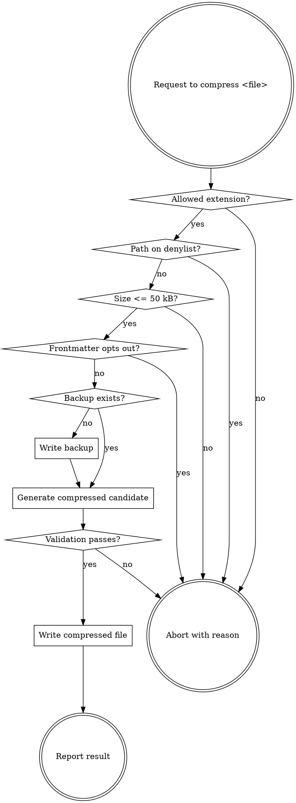

# Compress Memory

## Purpose

Compress natural-language memory files into a terser form that preserves every byte a downstream consumer (skill or human) might key off. Reduces input tokens replayed every Claude Code session.

This is **input token compression**. Caveman-style output speech is explicitly NOT in scope (it would fight every skill in this suite that produces structured artifacts). See `NOTICE.md` for the relationship to caveman-compress.

## When to Use

### Explicit triggers

- `/compress-memory <filepath>` slash command
- Natural language: "compress STATE.md", "shrink CLAUDE.md", "compact this memory file"

### Automatic trigger

- `project-orchestration:pause-work` invokes this skill on `docs/planning/STATE.md` (and `ROADMAP.md` if dirty) when `docs/planning/ROADMAP.md` frontmatter contains `compress_memory: enabled`.

## When NOT to Use

This skill REFUSES the following files (see [safety-rules.md](safety-rules.md) for the full denylist):

- Any file under `docs/plans/` — these are plan documents read literally by downstream skills
- `*-design.md`, `*-impact-analysis*`, `*ui-contract*`, `*-review-*.md` — contracts between skills
- `MILESTONE.md` — rewritten on milestone transitions, not pause-work
- `CONVENTIONS.md` — machine-read before every commit and tag; its fields are prose, so compression can break them while validation still passes
- `*.original.md` — backup files
- Anything not `.md` or `.txt`
- Files larger than 50 kB
- Files with `compress: skip` or `compress_memory: skip` in their frontmatter

When asked to compress a denied file, refuse with the specific reason. Do not modify the file.

## Process

### Step 1 — Validate the file

1. Resolve the file path. If a relative path was given, resolve against the project root.
2. Check the extension is `.md` or `.txt`. If not → abort with reason.
3. Check the path against the denylist in [safety-rules.md](safety-rules.md). If denied → abort with the denylist pattern that matched and the user-facing message from safety-rules.md.
4. Read the file. If size > 50 kB → abort with reason.
5. If the file has YAML frontmatter and the frontmatter contains `compress: skip` or `compress_memory: skip` → abort with the per-file opt-out message.

### Step 2 — Back up the original

1. Compute backup path: replace the file's `.md` (or `.txt`) extension with `.original.md` (or `.original.txt`). For `docs/planning/STATE.md`, the backup is `docs/planning/STATE.original.md`. NOT `STATE.md.original.md`.
2. If the backup file already exists → leave it untouched. The first backup is canonical.
3. If the backup file does NOT exist → write the original content to it before any modification of the source file.
4. If the backup write fails for any reason → abort WITHOUT modifying the original. Report the failure.

### Step 3 — Generate the compressed candidate

Apply the rules in [compression-rules.md](compression-rules.md):

1. Drop: articles, filler adverbs, pleasantries, hedging, connective fluff, imperative softeners.
2. Replace: verbose phrasing with shorter equivalents from the table.
3. Preserve byte-exact: fenced code blocks, indented code blocks, inline code spans, URLs and markdown links, file paths, shell commands, environment variables, version numbers, dates, frontmatter blocks, markdown tables (structure + cell text follows the same rules), headings (level + exact text), list nesting.

Apply rules to PROSE ONLY. Treat code blocks as read-only regions.

### Step 4 — Validate the compressed candidate

Run all of the following mechanical checks BEFORE writing the candidate to disk. Each check compares the candidate against the original input.

1. **Fenced code blocks** — extract every fenced block from input and from candidate. Counts must match. Each block must be byte-equal.
2. **Indented code blocks** — extract every 4-space indented code block. Counts must match. Each block must be byte-equal.
3. **Inline code spans** — count must match.
4. **URLs** — extract the full set of URLs from input and from candidate. Sets must be equal (no additions, no removals).
5. **Markdown headings** — extract every heading line. Count, exact text, and order must match.
6. **Frontmatter** — if input has a frontmatter block, candidate must have a byte-equal frontmatter block. If input has no frontmatter, candidate must also have none.
7. **Markdown tables** — count of table blocks must match; column count per table must match.

If ANY check fails:

- Do NOT write the candidate to disk.
- Confirm the original file still matches the backup (it should — we haven't written anything).
- Report the specific failure to the user.
- If invoked from `pause-work`, return failure to the parent so it can log and continue with the uncompressed file.

### Step 5 — Write the compressed file

If all validation checks pass:

1. Write the compressed candidate over the original file path using the `Write` tool.
2. Verify the write succeeded by re-reading the file and confirming size matches the candidate.
3. Report to the user:

   > Compressed `<path>`:
   > - Before: `<X>` bytes
   > - After: `<Y>` bytes
   > - Saved: `<Z>%`
   > - Backup: `<basename>.original.md` (e.g. `docs/planning/STATE.md` → `docs/planning/STATE.original.md`)

## Decision Tree

## Common Mistakes

1. **Modifying code inside fenced blocks** — even "obvious cleanups" inside triple-backtick fences are forbidden. Treat code blocks as read-only.
2. **Compressing tables by deleting columns** — table structure (pipe layout, alignment row, column count) is preserved. Only cell prose follows drop/replace rules.
3. **"Just one URL changed" — that's a failure** — URL set equality is strict. A typo'd URL is a validation failure, not a successful compression.
4. **Re-overwriting `*.original.md`** — the first backup is canonical. Do not re-create the backup on subsequent compressions; the user wants to be able to recover the pristine version.
5. **Operating on a denylisted file because the user asked** — denylist is hard-coded for a reason. Refuse, explain why, point at the safer files.
6. **Appending `.original.md` to the full filename** — backup naming REPLACES the extension. `STATE.md` → `STATE.original.md`, NOT `STATE.md.original.md`. Getting this wrong silently violates the denylist pattern matching.

## References

- [compression-rules.md](compression-rules.md) — the drop/replace/preserve rules in detail
- [safety-rules.md](safety-rules.md) — denylist, backup invariant, validation
- [NOTICE.md](NOTICE.md) — attribution to caveman (MIT)
