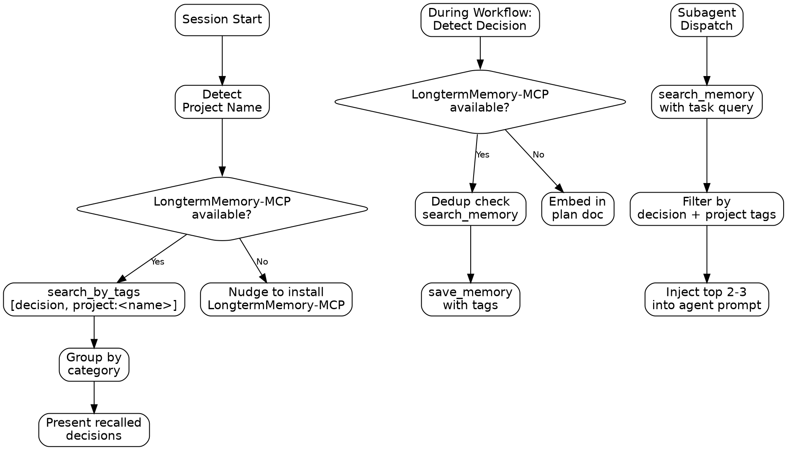

# Decision Tracker Skill

## Prerequisites

This skill requires LongtermMemory-MCP tools (`save_memory`, `search_memory`, `search_by_tags`, `search_by_date_range`, `update_memory`, `delete_memory`) for full functionality.

**MCP server setup:** The `longterm-memory` MCP server is configured by the [LongtermMemory-MCP](https://github.com/MarcelRoozekrans/LongtermMemory-MCP) companion plugin, which is pulled in automatically as a marketplace dependency. Install it with:

```bash
claude plugin install longterm-memory
```

The skill degrades gracefully when these tools are not available — see the [Graceful Degradation](#graceful-degradation) section.

## Overview

This skill automatically extracts cross-cutting decisions during design and planning workflows, persists them to long-term memory, and recalls them at session start and subagent dispatch. The core principle is:

**"Decisions made once should never be forgotten."**

This is not a standalone workflow. It enriches existing superpowers skills with persistent decision context, ensuring that architectural choices, naming conventions, and project constraints survive across sessions and are available to every agent working on the project.

## Announce Line

When this skill is activated, begin with:

> "Checking for project decisions in long-term memory. I'll recall existing decisions and track new ones throughout this session."

## When to Use

Invoke this skill when:

- **Starting any session** on a project with existing decisions
- **During brainstorming** when design choices are approved
- **During writing-plans** when conventions apply across tasks
- **During refactor-analysis** when constraints are identified
- **When subagent-driven-development dispatches agents** to inject relevant decisions into agent prompts

Do NOT use this skill when:

- The project is brand new with no prior decisions
- Working on a one-off task with no cross-cutting impact
- LongtermMemory-MCP is not installed AND no plan documents exist

## Checklist

Use this checklist to track progress:

- [ ] **Detect project name** — Determine project scope for tagging
- [ ] **Recall existing decisions** — Search long-term memory for prior decisions
- [ ] **Present recalled decisions** — Group and display to establish context
- [ ] **Track new decisions during session** — Extract from brainstorming, writing-plans, refactor-analysis
- [ ] **Inject decisions into subagents** — Targeted recall at dispatch time

## Process Flow



## Decision Categories

| Category | Memory Type | Importance | Tags | Example |
|---|---|---|---|---|
| **Architectural** | `fact` | 9 | `decision`, `project:<name>`, `architectural`, domain tags | "We use the repository pattern with unit of work" |
| **Convention** | `fact` | 7 | `decision`, `project:<name>`, `convention`, domain tags | "All DTOs go in the Contracts project" |
| **Task-specific** | `task` | 5 | `decision`, `project:<name>`, `task-specific`, domain tags | "UserService refactor must preserve backward compat with v2 API" |

Domain tags are free-form labels describing the technical area (e.g., `auth`, `api`, `database`, `di`, `testing`). Use consistent tags within a project.

## Project Name Detection

Derive the project name from (in priority order):

1. **Git remote origin** — run `git remote get-url origin` and extract the repository name
2. **Solution file name** — for .NET projects, use the `*.sln` filename in the working directory
3. **package.json name field** — read the `name` field from `package.json`
4. **Working directory name** — use the directory name as a fallback

**Worktree note:** When running in a git worktree, `git remote get-url origin` still returns the correct remote. However, the working directory name may reflect the worktree path rather than the project name. Prefer git remote or file-based detection over the directory name fallback.

## Decision Recall (Session Start)

When any superpowers skill activates, recall existing decisions:

1. **Detect the project name** using the priority order above.
2. **Call `search_by_tags`** with `["decision", "project:<name>"]`.
3. **Group results by category** — architectural first, then convention, then task-specific.
4. **Present the results:**

   > "Recalled N decisions for ProjectName:"

   Followed by the grouped list of decisions.

5. **Validate stale decisions** — after the main recall, call `search_by_date_range` with:
   - `start`: a fixed epoch date earlier than any realistic decision date (e.g., `2000-01-01`)
   - `end`: today's date minus 90 days

   Then filter the results to only those that have both `decision` and `project:<name>` in their tags (same project name detected in step 1).

   - If no stale decisions are found, skip this step entirely — do not prompt the user.
   - If stale decisions are found, present them grouped under a **"Decisions to validate (90+ days old)"** heading and for each ask:

     > "This decision is N months old: [decision]. Still valid?"

     - User confirms → no action
     - User says no longer valid → call `delete_memory`
     - User says superseded → call `update_memory` to record what replaced it

6. **Once per session** — this recall happens once at the start. Do NOT re-recall on every skill invocation.

7. **If `search_by_tags` is not available:** Skip recall and announce:

   > "LongtermMemory-MCP not detected. Install it to persist decisions across sessions: `claude install gh:MarcelRoozekrans/LongtermMemory-MCP`"

## Decision Extraction (Save)

Decision extraction is automatic — no explicit "save this" step is needed.

### What Qualifies as a Decision

- Technology or pattern choices ("we'll use the repository pattern")
- Placement rules ("DTOs go in Contracts")
- Constraints ("must preserve backward compat")
- Naming conventions ("all handlers end with Handler")
- Cross-cutting rules ("every service must log to ILogger")

### When to Extract

- **During brainstorming:** When the user selects from proposed approaches, save the chosen approach as an architectural decision. When the user approves a design section, scan for additional cross-cutting statements (placement rules, constraints, naming conventions) and save each as a decision.
- **During writing-plans:** When conventions apply across all tasks, save as convention decisions.
- **During refactor-analysis:** Phase 1 refactor approach, Phase 4 impact constraints, and Phase 5 risks flagged as high severity — save as task-specific decisions.

### Deduplication

Before saving, call `search_memory` with the decision text. If a semantically similar decision already exists (returned with high relevance), call `update_memory` on the existing one instead of creating a duplicate.

### Announce

After saving, say:

> "Saved N decisions to long-term memory: [numbered list]"

### Without LongtermMemory-MCP

If `save_memory` is not available, embed decisions in the plan document under a `## Cross-Cutting Decisions` section. Nudge:

> "Install LongtermMemory-MCP to persist these decisions across sessions."

## Subagent Injection

When subagent-driven-development dispatches an agent, the controller (not the subagent) performs the following before filling in the implementer prompt template:

1. **Derive a natural language query** from the task description.
2. **Call `search_memory`** with that query.
3. **Filter the semantic search results** to only include those that have both `decision` and `project:<name>` in their tags. This is a post-processing step on the results from step 2.
4. **Include only the top 2-3 most relevant decisions** in the agent's prompt.
5. **Format as:**

   > "Cross-cutting decisions relevant to this task: [list]"

6. **Inject into the `## Context` section** of the implementer prompt template, alongside other scene-setting context.

## Graceful Degradation

| Action | With LongtermMemory-MCP | Without |
|---|---|---|
| Recall at session start | `search_by_tags` → grouped list | Skip, nudge to install |
| Stale validation | `search_by_date_range` → filter → ask user | Skip stale validation (tool unavailable) |
| Save during brainstorming | `save_memory` with tags | Embed in plan doc |
| Save during writing-plans | `save_memory` with tags | Embed in plan doc |
| Save during refactor-analysis | `save_memory` with tags | Embed in plan doc |
| Subagent injection | `search_memory` → targeted | Include plan doc decisions section in prompt |

## Red Flags

These are mistakes that compromise the quality of decision tracking. If you notice yourself doing any of these, stop and correct course:

1. **Saving every statement as a "decision"** — Decisions must be cross-cutting, not local to one file. A choice about how to format a single function is not a decision worth persisting.

2. **Skipping deduplication** — Always search before saving to avoid duplicate memories. Redundant decisions dilute search relevance.

3. **Not recalling at session start** — Even for "quick tasks", prior decisions matter. A quick fix that contradicts an architectural decision creates technical debt.

4. **Flooding subagents with all decisions** — Use targeted semantic search, not a full dump. Subagents work best with 2-3 relevant decisions, not 20.

5. **Saving implementation details as decisions** — Decisions are about "what" and "why", not "how". "We use the repository pattern" is a decision; "the repository class has a GetById method" is an implementation detail.

## Common Rationalizations

| Rationalization | Why It's Wrong | Correct Action |
|---|---|---|
| "This is a quick task, no need to recall" | Quick tasks can still contradict prior decisions | Always recall at session start |
| "I'll remember this decision" | Memory doesn't persist across sessions | Save it to long-term memory |
| "This is just for this file" | If it affects how other code interacts, it's cross-cutting | Save only truly cross-cutting decisions |
| "The plan doc has all the decisions" | Plan docs aren't searched semantically by subagents | Persist to long-term memory for targeted retrieval |
| "I'll save everything to be safe" | Over-saving dilutes relevance of search results | Only save cross-cutting decisions, not implementation details |

## Quick Reference

| Action | Key Steps | Tools Used |
|---|---|---|
| Project detection | Git remote → .sln → package.json → directory name | `Bash` (git remote) |
| Session recall | search_by_tags → group → present → validate stale | `search_by_tags` |
| Decision extraction | Identify cross-cutting statement → dedup → save | `search_memory`, `save_memory` |
| Stale validation | `search_by_date_range` (end = today − 90d) → filter by tags → ask user → delete or update | `search_by_date_range`, `delete_memory`, `update_memory` |
| Subagent injection | Derive query → search → filter → inject top 2-3 | `search_memory` |
| Graceful degradation | Check tool availability → embed in plan doc if missing | `Write` (plan doc) |

## Relationship to Superpowers Skills

This skill is designed to complement — not replace — the superpowers workflow skills. Here is how they fit together:

| Superpowers Skill | Relationship | Notes |
|---|---|---|
| `superpowers:brainstorming` | **Always-on when available.** Recalls existing decisions at brainstorming start to inform design. Extracts and saves new decisions when design choices are approved. | Decisions from prior sessions prevent contradictory designs. |
| `superpowers:writing-plans` | **Adds decisions after plan header.** Recalls all project decisions and adds a `## Cross-Cutting Decisions` section after the plan header so every task can reference them. Saves new convention decisions. | Subagents executing the plan inherit these decisions. |
| `superpowers:subagent-driven-development` | **Injects targeted decisions per agent.** Uses semantic search to find the 2-3 decisions most relevant to each subagent's task and includes them in the prompt. | Keeps subagent context focused rather than flooding with all decisions. |
| `refactor-analysis` | **Saves constraints, recalls architecture.** Refactor approach (Phase 1) and constraints (Phase 4) are saved as task-specific decisions. Architectural decisions are recalled to inform impact classification. | Ensures refactor respects established patterns. |
| `pre-push-review` | **Decisions available for reference.** Architectural and convention decisions are available during Phase 3 (Code Quality) to verify implementation respects established patterns. No active extraction or saving. | Read-only — decisions inform the review but pre-push-review does not modify them. |
| `longterm-memory:long-term-memory` | **Required dependency.** Provides the persistence layer (`save_memory`, `search_memory`, `search_by_tags`, `search_by_date_range`, `update_memory`, `delete_memory`) that this skill uses to store and recall decisions. | Skill degrades gracefully without it — see Graceful Degradation section. |

**Recommended workflow chain:**

```text
brainstorming (decision-tracker: recall prior decisions, extract new ones)
  → refactor-analysis (decision-tracker: recall architecture, save constraints)
  → writing-plans (decision-tracker: embed all decisions in plan header)
  → subagent-driven-development (decision-tracker: inject targeted decisions per agent)
  → pre-push-review (decision-tracker: decisions available for reference)
```
