# Pre-Push Review Skill

## Prerequisites

This skill requires a **git repository** with at least one commit on a feature branch that differs from the base branch. No additional MCP servers are required for the core review.

**Optional:** If the project has a web UI and you want browser-based regression testing as part of the review, install the **Microsoft Playwright MCP server** (`@playwright/mcp`):

```bash
claude mcp add playwright -- npx @playwright/mcp@latest --caps=testing
```

## Overview

This skill defines a structured, comprehensive branch review process to run before pushing code or creating a pull request. The core principle is:

**"Never push without reviewing every change against the plan, the rules, and the tests."**

The review covers four dimensions: verifying that planned work was completed (and nothing unplanned snuck in), checking code quality against established rules, ensuring commits are clean and free of secrets or artifacts, and confirming that tests still pass. The result is a clear PASS or FAIL verdict. On failure, a prioritized remediation plan is generated with specific steps to fix each issue.

This skill can be invoked standalone (`/pre-push-review`) or as part of a larger workflow (e.g., before finishing a development branch or before creating a PR).

## Announce Line

When this skill is activated, begin with:

> "Starting pre-push review. I'll review the branch diff across four dimensions: plan adherence, code quality, commit hygiene, and regression testing. I'll auto-detect the base branch and produce a PASS/FAIL verdict."

## When to Use

Invoke this skill in any of the following situations:

- **Before pushing a branch** — The feature branch is ready and you want a quality gate before pushing to remote.
- **Before creating a PR** — You want to verify the branch is clean, complete, and ready for peer review.
- **After completing a development plan** — All planned tasks are done and you want to verify nothing was missed and nothing broke.
- **When asked to review the branch** — The user explicitly requests a branch review, diff review, or pre-push check.
- **Before merging** — A final quality gate before integrating changes into the main branch.
- **When finishing a development branch** — As part of the branch completion workflow, ensuring quality before the final step.

## Checklist

Use this checklist to track progress through the six phases:

- [ ] **Phase 1: Setup & Context** — Detect base branch, gather diff, find plan docs and project rules
- [ ] **Phase 2: Plan Adherence** — Compare changes against the plan document
- [ ] **Phase 3: Code Quality** — Review diff for security, YAGNI, debug code, dead code, error handling, naming, test coverage
- [ ] **Phase 4: Commit Hygiene** — Check commits for secrets, large files, unintended files, conflict markers, message quality
- [ ] **Phase 5: Regression Testing** — Run existing test suites and optionally browser-based testing
- [ ] **Phase 6: Verdict & Report** — Generate report with PASS/FAIL verdict and remediation plan if needed

## Process Flow

The following Graphviz diagram illustrates the full pre-push review workflow:

```dot
digraph pre_push_review {
    rankdir=TB;
    node [shape=box, style=rounded, fontname="Helvetica"];
    edge [fontname="Helvetica", fontsize=10];

    setup [label="Phase 1:\nSetup & Context"];
    detect_base [label="Auto-detect\nbase branch", shape=diamond];
    ask_base [label="Ask user for\nbase branch"];
    gather_diff [label="Gather diff,\nlog, changed files"];
    find_plan [label="Find plan docs\n& project rules"];

    has_plan [label="Plan doc\nexists?", shape=diamond];
    plan_review [label="Phase 2:\nPlan Adherence"];
    skip_plan [label="Skip plan review\n(note in report)"];

    code_quality [label="Phase 3:\nCode Quality"];
    commit_hygiene [label="Phase 4:\nCommit Hygiene"];

    has_tests [label="Test suites\nfound?", shape=diamond];
    run_tests [label="Phase 5:\nRun Tests"];
    skip_tests [label="Skip tests\n(note in report)"];

    has_ui [label="Web UI with\nURL available?", shape=diamond];
    regression [label="Invoke\nregression-test skill"];

    collect [label="Collect all\nfindings"];
    verdict [label="Phase 6:\nVerdict"];
    pass [label="PASS\nGreen light"];
    fail [label="FAIL\nGenerate\nremediation plan"];
    report [label="Generate\nreport"];
    summary [label="Conversation\nsummary"];

    setup -> detect_base;
    detect_base -> gather_diff [label="Found"];
    detect_base -> ask_base [label="Ambiguous"];
    ask_base -> gather_diff;
    gather_diff -> find_plan;
    find_plan -> has_plan;

    has_plan -> plan_review [label="Yes"];
    has_plan -> skip_plan [label="No"];
    plan_review -> code_quality;
    skip_plan -> code_quality;

    code_quality -> commit_hygiene;
    commit_hygiene -> has_tests;

    has_tests -> run_tests [label="Yes"];
    has_tests -> skip_tests [label="No"];
    run_tests -> has_ui;
    skip_tests -> has_ui;

    has_ui -> regression [label="Yes"];
    has_ui -> collect [label="No"];
    regression -> collect;

    collect -> verdict;
    verdict -> pass [label="No blockers\n< 3 warnings"];
    verdict -> fail [label="Any blocker\nor 3+ warnings"];
    pass -> report;
    fail -> report;
    report -> summary;
}
```



## Phase 1: Setup & Context Gathering

This phase establishes the review scope by identifying the base branch, gathering the diff, and locating relevant project documentation.

### Auto-Detect Base Branch

Determine the base branch using this priority order:

1. **Tracking branch** — Run `git rev-parse --abbrev-ref @{upstream} 2>/dev/null` to check if the current branch tracks a remote branch. If so, extract the base branch name.
2. **Common main branches** — Check if `main`, `master`, or `develop` branches exist using `git show-ref --verify refs/heads/<name>`.
3. **Ask the user** — If none of the above resolve, ask: "I couldn't auto-detect the base branch. Which branch should I diff against?"

### Gather the Diff

Once the base branch is identified, run these commands:

1. `git diff <base>...HEAD --stat` — Changed files summary (file names and change counts)
2. `git diff <base>...HEAD` — Full diff content for review
3. `git diff <base>...HEAD --name-only` — Plain list of changed file paths
4. `git log <base>..HEAD --oneline` — Commit history on this branch
5. `git log <base>..HEAD --format="%H %s"` — Commit hashes and messages for hygiene checks

### Find Plan Documents

Search for relevant plan or design documents:

1. Glob for `docs/plans/*.md` — Read each to see if it relates to the current branch or feature
2. Match by branch name: if the branch is `feat/user-auth`, look for plans mentioning "user auth" or "authentication"
3. Check for `CLAUDE.md` in the project root — project-level rules and conventions
4. Check for `.cursorrules`, `.windsurfrules`, or similar convention files

Record which plan document (if any) will be used for the plan adherence review.

## Phase 2: Plan Adherence Review

If a plan document was found in Phase 1, compare the actual changes against what was planned. If no plan was found, skip this phase and note it in the report.

### Steps

1. **Read the plan document** — Extract all planned tasks, features, and changes.

2. **Map plan items to diff** — For each planned item, check whether the diff contains corresponding changes:
   - Search for file paths mentioned in the plan
   - Search for function/class/component names mentioned in the plan
   - Search for feature descriptions that map to code changes

3. **Identify missing items** — List any planned items that have no corresponding changes in the diff. These are gaps that need to be addressed before pushing.

4. **Identify unplanned changes** — List any significant changes in the diff that are not mentioned in the plan. Minor changes (formatting, import reordering) are acceptable; new features or behavioral changes are not.

5. **Record findings** with severity:
   - **Blocker**: Planned feature entirely missing from the diff
   - **Warning**: Planned feature partially implemented; significant unplanned changes
   - **Info**: Minor unplanned changes (formatting, small refactors)

## Phase 3: Code Quality Review

Review the full diff for code quality issues. Apply the rules defined in [code-quality-rules.md](code-quality-rules.md).

### Steps

1. **Get the full diff** — Use the diff gathered in Phase 1.

2. **Categorize changed files** — Separate files into: source code, test files, configuration, documentation, and other. Focus the quality review on source code files.

3. **Apply each rule** from the code quality rules document:
   - Rule 1: Security (OWASP Top 10)
   - Rule 2: YAGNI and Over-Engineering
   - Rule 3: Debug and Temporary Code
   - Rule 4: Dead Code and Unused Imports
   - Rule 5: Error Handling
   - Rule 6: Naming and Readability
   - Rule 7: Test Coverage

4. **Focus on added and modified lines** — Only review lines that were changed (lines starting with `+` in the diff, excluding `+++` file headers). Do not flag issues in unchanged code.

5. **Record each finding** with: rule number, file path, line reference, description, and severity.

## Phase 4: Commit Hygiene Review

Review the commits and changed files for hygiene issues. Apply the rules defined in [commit-hygiene-rules.md](commit-hygiene-rules.md).

### Steps

1. **Check commit messages** — Review each commit message from `git log <base>..HEAD` against the commit message quality rules.

2. **Scan for secrets** — Search the full diff for secret patterns defined in the commit hygiene rules. Pay special attention to:
   - Newly added `.env` files
   - Inline API keys or tokens
   - Private keys

3. **Check for unintended files** — Review the changed files list for files that should not be in version control (node_modules, build artifacts, OS files, large binaries).

4. **Check for merge conflict markers** — Search the diff for `<<<<<<<`, `=======`, `>>>>>>>` patterns.

5. **Check file sizes** — For new files in the diff, check their sizes against the thresholds.

6. **Record each finding** with: rule number, file path, description, and severity.

## Phase 5: Regression Testing

Run existing test suites to verify the branch hasn't broken anything.

### Steps

1. **Detect test frameworks** — Use the same detection logic as the regression-test skill: check for config files (`jest.config.*`, `vitest.config.*`, `playwright.config.*`, `cypress.config.*`, etc.) and package.json scripts.

2. **Run test suites** — Execute each detected test suite:
   - Prefer package.json scripts (`npm test`, `npm run test:e2e`, etc.)
   - Fall back to direct runner commands (`npx jest`, `npx vitest run`, etc.)
   - Append reporter flags for parseable output

3. **Capture results** — Record:
   - Exit code
   - Total/passed/failed/skipped counts
   - Names and error messages of failing tests
   - Full output for the report

4. **Optional: Browser-based regression testing** — If the project has a web UI and the user confirms a URL is available, offer to invoke the regression-test skill for visual and functional browser testing. This is optional and requires user confirmation.

5. **Record findings**:
   - **Blocker**: Any test failure
   - **Warning**: Tests skipped with `.skip` or `@Ignore` (may indicate incomplete work)
   - **Info**: All tests passing; no test suites found (noted for awareness)

## Phase 6: Verdict & Report

Collect all findings from Phases 2-5, determine the verdict, and generate the report.

### Verdict Logic

| Condition | Verdict |
|---|---|
| Any **Blocker** finding in any phase | **FAIL** |
| Three or more **Warning** findings across all phases | **FAIL** |
| Fewer than 3 warnings and no blockers | **PASS** |

### Report Generation

Save the report to:

```text
docs/pre-push-review-YYYY-MM-DD-HHmm.md
```

### Report Structure

#### Header

| Metric | Value |
|---|---|
| Date | YYYY-MM-DD HH:mm |
| Branch | (current branch name) |
| Base Branch | (base branch name) |
| Commits Reviewed | (count) |
| Files Changed | (count) |
| Lines Added | (count) |
| Lines Removed | (count) |
| Verdict | **PASS** or **FAIL** |

#### Plan Adherence Results

- Plan document used (or "No plan document found")
- Planned items: implemented / total
- Missing implementations (if any)
- Unplanned changes (if any)

#### Code Quality Results

- Findings grouped by rule, with file:line references
- Severity for each finding

#### Commit Hygiene Results

- Commit message quality assessment
- Secrets scan results
- Unintended files detected
- Merge conflict markers
- Large files

#### Regression Test Results

- Framework(s) detected
- Commands executed
- Pass/fail/skip counts
- Failing test details (if any)

#### Remediation Plan (FAIL verdict only)

When the verdict is FAIL, include a remediation plan:

1. **Numbered list of issues** ordered by severity (blockers first, then warnings)
2. **File and line references** for each issue
3. **Suggested fix** for each issue — specific, actionable instructions
4. **Effort estimate** per issue: Quick fix (< 5 min) / Moderate (5-30 min) / Significant (> 30 min)

### Conversation Summary

After generating the report, provide a concise summary in the conversation:

1. **Verdict** — PASS or FAIL in bold
2. **Issue counts** — X blockers, Y warnings, Z info items
3. **Top 3 findings** — The three most important issues (or "No issues found" on PASS)
4. **Remediation plan summary** — (FAIL only) Brief list of what needs fixing
5. **Report path** — Full file path to the generated report

## Red Flags

These are mistakes that compromise the quality of a pre-push review. If you notice yourself doing any of these, stop and correct course:

1. **Skipping the diff** — Every review must be based on the actual `git diff`. Do not make assumptions about what changed based on file names alone.

2. **Ignoring the plan** — If a plan document exists, it must be compared against the diff. Do not skip plan adherence because "the code looks fine."

3. **Glossing over security issues** — Every pattern match for secrets or security vulnerabilities must be investigated. Do not dismiss regex matches as false positives without examining the actual content.

4. **Not running tests** — If test suites exist, they must be run. Do not skip tests because "they probably pass" or "we only changed CSS."

5. **Soft-passing a failing review** — If blockers are found or warnings exceed the threshold, the verdict is FAIL. Do not rationalize a PASS verdict to avoid delivering bad news.

6. **Generating a report without reviewing** — The report must reflect actual review findings. Never generate a placeholder or optimistic report without completing all phases.

## Common Rationalizations

These are excuses that sound reasonable but lead to incomplete reviews. The correct response to each is provided.

| Rationalization | Why It's Wrong | Correct Action |
|---|---|---|
| "It's just a small change, no need for a full review" | Small changes can contain secrets, break tests, or violate the plan | Run the full review process |
| "The tests passed in CI" | This review checks more than tests: plan adherence, code quality, commit hygiene | Complete all phases regardless of CI status |
| "I know this code is fine, I just wrote it" | Self-review bias is real; systematic checks catch what memory misses | Follow the process mechanically |
| "The plan is outdated, so skip plan adherence" | If the plan is outdated, that's a finding worth noting | Review against the plan; note discrepancies |
| "Those regex matches are just false positives" | Every match must be verified; real secrets look like false positives | Examine each match; only dismiss with evidence |
| "There are too many warnings, let's just note them" | Three or more warnings is a FAIL verdict; they indicate systematic issues | Apply the verdict rules strictly |
| "We can fix the commit messages later" | Commit messages are part of the permanent record; "later" rarely happens | Flag them now |

## Quick Reference

Use this table for a fast reminder of what each phase involves and which tools are needed.

| Phase | Key Actions | Tools Used |
|---|---|---|
| Phase 1: Setup & Context | Detect base branch, gather diff, find plans | `git` commands, `Glob`, `Read` |
| Phase 2: Plan Adherence | Compare diff against plan document | `Read`, `Grep` |
| Phase 3: Code Quality | Review diff for 7 quality rules | `Grep`, diff analysis |
| Phase 4: Commit Hygiene | Check commits, secrets, files, markers | `git` commands, `Grep` |
| Phase 5: Regression Testing | Run test suites, optionally browser testing | `Bash` (test runners), optionally Playwright MCP |
| Phase 6: Verdict & Report | Generate report, determine PASS/FAIL | `Write` (markdown report) |

## Relationship to Superpowers Skills

This skill is designed to complement — not replace — the superpowers workflow skills. Here is how they fit together:

| Superpowers Skill | Relationship | Notes |
|---|---|---|
| `finishing-a-development-branch` | **Run pre-push-review first.** This skill gates whether the branch is ready; finishing-a-development-branch decides how to integrate it (merge, PR, cleanup). | Pre-push-review produces the evidence that finishing-a-development-branch needs. |
| `verification-before-completion` | **This skill satisfies it.** Verification-before-completion requires evidence before success claims. A PASS verdict from this skill is that evidence. | No need to run both — a completed pre-push-review covers verification. |
| `requesting-code-review` | **This skill supersedes it.** Pre-push-review includes code quality review (Phase 3) plus plan adherence, commit hygiene, and regression testing. | If pre-push-review has been run, skip requesting-code-review to avoid redundant work. |

**Recommended workflow chain:**

```text
Implementation complete
  → pre-push-review (this skill: structured quality gate)
  → finishing-a-development-branch (superpowers: merge/PR decision)
```

## Supporting References

The following companion documents provide detailed criteria referenced throughout this skill:

- [code-quality-rules.md](code-quality-rules.md) — Detailed code review criteria covering security, YAGNI, debug code, dead code, error handling, naming, and test coverage, with severity classifications.
- [commit-hygiene-rules.md](commit-hygiene-rules.md) — Commit message quality, secrets detection patterns, unintended file checks, merge conflict markers, and large file detection with severity classifications.
