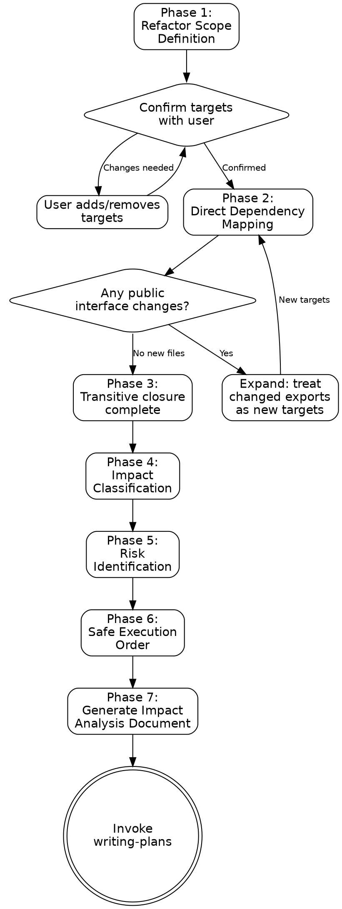

# Refactor Analysis Skill

## Prerequisites

This skill requires only built-in tools (Grep, Glob, Read, Bash). No MCP servers are needed.

## Overview

This skill performs a comprehensive, transitive impact analysis for refactoring tasks. The core principle is:

**"Before changing anything, map everything that will break."**

Brainstorming establishes what to refactor and why. This skill maps the full blast radius: every file affected, how it's affected, what risks exist, and in what order changes should be made so nothing breaks mid-refactor. The output is an impact analysis document that writing-plans consumes to produce safe, ordered implementation steps.

## Announce Line

When this skill is activated, begin with:

> "Starting refactor impact analysis. I'll identify all refactor targets, map every direct and transitive dependency, classify each impact, flag risks, and produce a safe execution order."

## When to Use

Invoke this skill when:

- **After brainstorming a refactor** — The design is approved and the task involves changing existing code rather than creating new code.
- **Before writing-plans for a refactor** — An impact analysis doesn't exist yet and the refactor touches multiple files.
- **When asked for impact analysis** — The user explicitly asks what will be affected by a change.
- **When a refactor scope feels uncertain** — You're not sure how deep the changes will ripple.

Do NOT use this skill when:

- The task is purely greenfield (no existing code to analyze)
- The change is isolated to a single file with no dependents
- An impact analysis already exists and is current

## Checklist

Use this checklist to track progress through the seven phases:

- [ ] **Phase 1: Refactor Scope Definition** — Identify targets, confirm with user, classify refactor type
- [ ] **Phase 2: Direct Dependency Mapping** — Search for all direct references to each target
- [ ] **Phase 3: Transitive Closure** — Expand to indirect dependencies until no new files appear
- [ ] **Phase 4: Impact Classification** — Classify each affected file as Breaking / Update Required / Test Impact / Cosmetic
- [ ] **Phase 5: Risk Identification** — Flag dynamic references, cross-boundary impacts, circular deps, high fan-in
- [ ] **Phase 6: Safe Execution Order** — Topological sort into change groups with checkpoint boundaries
- [ ] **Phase 7: Output** — Generate impact analysis document and transition to writing-plans

## Process Flow



## Phase 1: Refactor Scope Definition

This phase identifies exactly what is being changed and confirms the scope with the user.

### Steps

1. **Read the design doc** — If a brainstorming design doc exists in `docs/plans/`, read it and extract the refactoring intent.

2. **Identify refactor targets** — List every concrete thing being changed:
   - Classes, interfaces, types
   - Functions, methods
   - Modules, files, directories
   - API endpoints, routes
   - Database tables, columns
   - Configuration keys

3. **Classify the refactor type** for each target:

   | Type | Description | Typical Depth |
   |---|---|---|
   | **Rename** | Name changes, path moves | Medium — all references update |
   | **Move** | Relocating to different module/directory | Deep — import paths cascade |
   | **Extract** | Pulling code out into new unit | Shallow — mostly the source file |
   | **Inline** | Collapsing abstraction back into callers | Medium — all call sites |
   | **Change Interface** | Modifying function signatures, type shapes | Deep — all consumers must adapt |
   | **Architectural** | Restructuring module boundaries, patterns | Very deep — full transitive analysis |

4. **Confirm with the user** — Present the target list and ask: "These are the refactor targets I identified. Anything missing or incorrect?" Do NOT proceed until the user confirms.

## Phase 2: Direct Dependency Mapping

For each confirmed target, find every direct reference in the codebase.

### Steps

1. **Search systematically** using the reference types catalog in [reference-types.md](reference-types.md). For each target, run searches for:
   - Import/require statements referencing the target
   - Type annotations and generic usage
   - Function calls and method invocations
   - Class inheritance and interface implementations
   - Configuration file references
   - String-based references (dynamic imports, reflection)
   - Test file references (imports, mocks, fixtures, snapshots)

2. **Use multiple search strategies** per target:
   - **Exact name match**: `Grep` for the target's exact name
   - **Path match**: `Grep` for the target's file path (for move/rename refactors)
   - **Glob for related files**: `Glob` for test files, config files, barrel exports that may reference the target
   - **String literal search**: `Grep` for the target name as a string (catches dynamic references)

3. **Record each reference** with:
   - File path and line number
   - Reference type (from the catalog)
   - How it uses the target (imports it, extends it, calls it, mocks it, etc.)
   - Whether the reference will break, need updating, or is cosmetic

4. **Build the direct dependency set** — the unique list of files containing at least one reference to any target.

## Phase 3: Transitive Closure

Expand the impact beyond direct dependencies to find the full ripple effect.

### Steps

1. **For each file in the direct dependency set**, determine: does this file's **public interface** change as a result of the refactor?

   A public interface changes when:
   - An exported function's signature changes (parameters, return type)
   - An exported type/interface shape changes
   - An exported class's public methods or constructor change
   - The file's module path changes (for move/rename)
   - A re-exported symbol changes

2. **If the public interface changes**, treat that file's changed exports as **new targets** and repeat Phase 2 for them.

3. **Continue expanding** until one of these termination conditions is met:
   - No new files are discovered in a round
   - No public interfaces change in the current set
   - A depth limit is reached (report this — it means the refactor is extremely broad)

4. **Build the full dependency graph**:
   - Nodes = all affected files (direct + transitive)
   - Edges = dependency relationships (A depends on B)
   - Track the depth at which each file was discovered (direct = depth 1, first transitive = depth 2, etc.)

## Phase 4: Impact Classification

Classify how each affected file is impacted to prioritize the work.

### Steps

1. **For each file in the dependency graph**, assign one classification:

   | Classification | Meaning | Criteria |
   |---|---|---|
   | **Breaking** | Will fail to compile, build, or run without changes | Import path no longer valid; type signature mismatch; missing export; deleted dependency |
   | **Update Required** | Functions but is incorrect or inconsistent | Naming conventions out of sync; documentation references stale; API contract technically works but is wrong |
   | **Test Impact** | Test files that need updating | Test imports broken; mocks reference old interface; snapshots stale; fixture data outdated |
   | **Cosmetic** | Optional cleanup for consistency | Comments reference old names; related naming could align; README mentions old structure |

2. **For each file**, also record:
   - Which specific target causes the impact
   - What concrete change is needed (e.g., "update import path from `./old` to `./new`", "change parameter type from `string` to `Options`")
   - Estimated complexity: trivial (mechanical find-replace), moderate (logic adjustment), complex (redesign needed)

3. **Produce the annotated file list** — a table with all affected files sorted by classification (Breaking first, then Update Required, Test Impact, Cosmetic).

## Phase 5: Risk Identification

Flag things that static analysis might miss or that are especially likely to cause problems.

### Risk Categories

Search for and flag each of these:

| Risk | Detection Method | Severity |
|---|---|---|
| **Dynamic references** | Search for target name in string literals, template strings, `eval()`, `Function()`, `require(variable)` | High — cannot verify statically |
| **Cross-boundary impacts** | Check for API contracts (OpenAPI specs, GraphQL schemas), database schemas, external config files | High — may affect other services |
| **Circular dependencies** | Trace the dependency graph for cycles involving any target | Medium — complicates execution order |
| **High fan-in nodes** | Count how many files depend on each target; flag if > 10 direct dependents | Medium — high blast radius |
| **Implicit coupling** | Check for convention-based discovery (auto-import directories, barrel exports, plugin registries) | Medium — no explicit reference to find |
| **Runtime registration** | Search for patterns like `register()`, `subscribe()`, `addEventListener()` with target | Medium — not in import graph |
| **External consumers** | Check if target is part of a published package, public API, or shared library | High — cannot analyze downstream |
| **Serialized state** | Search for target name in JSON, YAML, XML, database migration files | Medium — data compatibility |

### Steps

1. Run detection for each risk category against all targets.
2. For each identified risk, record: risk description, affected file(s), severity, and recommended mitigation.
3. Compile into a risk register.

## Phase 6: Safe Execution Order

Determine the order in which changes should be made so the codebase is never in a broken state for longer than necessary.

### Steps

1. **Topological sort** the dependency graph:
   - Leaf nodes (files that nothing else depends on) change first
   - Work inward toward the core targets
   - If cycles exist, group the cycle into one atomic change group

2. **Group changes into execution groups**:
   - Each group contains files that can be changed together
   - After each group, the codebase should be in a compilable/runnable state (or as close as possible)
   - Mark groups that MUST be atomic (cannot be split — e.g., an interface change and all its implementations)

3. **Identify checkpoint boundaries** — points between groups where:
   - Tests can be run to verify nothing is broken
   - A commit can be made safely
   - The refactor can be paused and resumed later

4. **Produce the execution order** as a numbered list of groups:
   - Group number and description
   - Files in the group
   - What changes in each file (brief)
   - Whether the group is atomic
   - Checkpoint action (e.g., "run tests", "verify build", "commit")

## Phase 7: Output

Generate the impact analysis document and transition to the implementation planning phase.

### Steps

1. **Save the impact analysis document** to:

   ```text
   docs/plans/YYYY-MM-DD-<topic>-impact-analysis.md
   ```

2. **Document structure:**

   ```markdown
   # Impact Analysis: <topic>

   ## Summary

   | Metric | Value |
   |---|---|
   | Date | YYYY-MM-DD HH:mm |
   | Refactor Type | (rename / move / extract / inline / change interface / architectural) |
   | Targets | (count) |
   | Directly Affected Files | (count) |
   | Transitively Affected Files | (count) |
   | Total Affected Files | (count) |
   | Breaking Changes | (count) |
   | Risks Identified | (count) |
   | Risk Level | (Low / Medium / High) |

   ## Dependency Graph

   (Graphviz dot diagram showing all affected files and their relationships.
   Color nodes by classification: red=Breaking, orange=Update Required,
   yellow=Test Impact, gray=Cosmetic. Bold border for targets.)

   ## Affected Files

   | # | File | Classification | Change Required | Caused By | Complexity |
   |---|---|---|---|---|---|
   | 1 | src/foo.ts | Breaking | Update import path from './old' to './new' | target-1 | Trivial |
   | ... | ... | ... | ... | ... | ... |

   ## Risk Register

   | # | Risk | Affected Files | Severity | Mitigation |
   |---|---|---|---|---|
   | 1 | Dynamic import in plugin loader | src/plugins/loader.ts | High | Manual verification after refactor |
   | ... | ... | ... | ... | ... |

   ## Execution Order

   ### Group 1: Leaf changes (no dependents)
   - `file-a.ts` — update import path
   - `file-b.ts` — update type annotation
   - **Checkpoint:** run tests, commit

   ### Group 2: Intermediate dependencies
   - `file-c.ts` — update export signature (ATOMIC with Group 3)
   - **Checkpoint:** verify build

   ### Group 3: Core targets
   - `target.ts` — apply the rename/move/interface change
   - **Checkpoint:** full test suite, commit
   ```

3. **Risk level determination:**

   | Condition | Risk Level |
   |---|---|
   | No high-severity risks, < 20 affected files | **Low** |
   | Any high-severity risk OR 20-50 affected files | **Medium** |
   | Multiple high-severity risks OR > 50 affected files | **High** |

4. **Conversation summary** — After generating the document, summarize:
   - Refactor type and target count
   - Total affected files with breakdown by classification
   - Top 3 risks
   - Number of execution groups
   - Document path

5. **Transition to writing-plans** — Invoke the writing-plans skill to create the implementation plan from this impact analysis document.

## Red Flags

These are mistakes that compromise the quality of a refactor analysis. If you notice yourself doing any of these, stop and correct course:

1. **Skipping the transitive closure** — Direct dependencies are not enough. A rename in file A that changes an export consumed by file B, which re-exports to file C, means C is also affected. Always trace until no new files appear.

2. **Ignoring string-based references** — Dynamic imports, reflection, serialized state, and convention-based discovery will not show up in import-based searches. Always search for the target name as a plain string across all files.

3. **Not confirming targets with the user** — Your initial target list may be incomplete. The user knows their codebase. Always confirm before proceeding.

4. **Treating test files as optional** — Test files are first-class citizens in impact analysis. Broken tests are broken code. Include them in every phase.

5. **Skipping the execution order** — Producing a list of affected files without an order is only half the job. The order is what makes the refactor safe.

6. **Assuming the refactor is simple** — Even a "simple rename" can have deep transitive effects. Run the full process. The output will be short if the impact is genuinely small.

## Common Rationalizations

| Rationalization | Why It's Wrong | Correct Action |
|---|---|---|
| "It's just a rename, I don't need impact analysis" | Renames cascade through imports, types, tests, configs, and string references | Run the full 7-phase process |
| "I can see all the usages in my IDE" | IDEs miss string references, config files, and dynamic usage | Supplement IDE results with systematic search |
| "The tests will catch anything I miss" | Tests only catch what they test; missing a reference in an untested path means a runtime error | Map everything first, then verify with tests |
| "Transitive analysis is overkill" | One missed transitive dependency means a broken build after the refactor | Trace until termination; the output is short if the impact is small |
| "I'll fix things as they break" | Reactive fixing wastes time and risks incomplete refactors | Proactive analysis prevents the fire drill |
| "The change is backward compatible" | Even backward-compatible changes may require test updates, documentation updates, and config alignment | Classify as Update Required or Cosmetic rather than skipping |

## Quick Reference

| Phase | Key Actions | Tools Used |
|---|---|---|
| Phase 1: Scope Definition | Read design doc, list targets, confirm with user | `Read`, `Glob`, user confirmation |
| Phase 2: Direct Mapping | Search all reference types for each target | `Grep`, `Glob`, `Read` |
| Phase 3: Transitive Closure | Expand through public interface changes until stable | `Grep`, `Glob`, `Read` |
| Phase 4: Classification | Assign Breaking / Update / Test / Cosmetic per file | Analysis of Phase 2-3 results |
| Phase 5: Risk Identification | Flag dynamic refs, cross-boundary, circular deps, high fan-in | `Grep`, `Bash` (git log for history) |
| Phase 6: Execution Order | Topological sort, group changes, identify checkpoints | Analysis of dependency graph |
| Phase 7: Output | Generate impact analysis doc, summarize, invoke writing-plans | `Write` (markdown document) |

## Relationship to Superpowers Skills

This skill is designed to complement — not replace — the superpowers workflow skills. Here is how they fit together:

| Superpowers Skill | Relationship | Notes |
|---|---|---|
| `superpowers:brainstorming` | **Runs before this skill.** Brainstorming establishes what to refactor and why. This skill maps the impact. | Brainstorming design doc is input to Phase 1. |
| `superpowers:writing-plans` | **Runs after this skill.** This skill's impact analysis document is consumed by writing-plans to produce safe, ordered implementation steps. | The execution order from Phase 6 directly informs the plan's task sequence. |
| `pre-push-review` | **Runs after implementation.** Once the refactor is implemented per the plan, pre-push-review validates the result. | Pre-push-review's code quality check verifies no references were missed. |

**Recommended workflow chain:**

```text
brainstorming (what and why)
  → refactor-analysis (this skill: blast radius and safe ordering)
  → writing-plans (implementation steps)
  → implementation
  → pre-push-review (quality gate)
  → finishing-a-development-branch (merge/PR decision)
```

## Supporting References

- [reference-types.md](reference-types.md) — Comprehensive catalog of reference types to search for during Phase 2, organized by language and framework.
