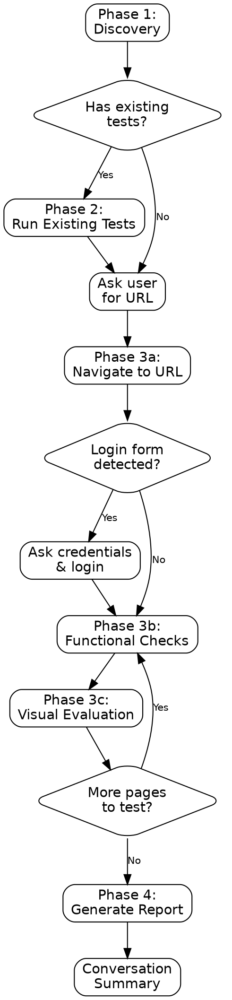

# Regression Test Skill

## Prerequisites

This skill requires the **Microsoft Playwright MCP server** (`@playwright/mcp`) with the `--caps=testing` flag, which enables `browser_verify_*` assertion tools and `browser_generate_locator` used in Phase 3b.

**Auto-configured:** When installed via `claude plugin install regression-test`, the `.mcp.json` automatically configures the `playwright` MCP server with `npx @playwright/mcp@latest --caps=testing`. No manual setup needed.

**Manual install (if not using the plugin):**

```bash
claude mcp add playwright -- npx @playwright/mcp@latest --caps=testing
```

**Optional flags:**

```bash
# Headed mode (see the browser window) + testing assertions
claude mcp add playwright -- npx @playwright/mcp@latest --caps=testing --headless=false

# All capabilities (testing + PDF export + vision-based coordinates)
claude mcp add playwright -- npx @playwright/mcp@latest --caps=testing,pdf,vision
```

For full configuration options (browser choice, viewport defaults, proxy, storage state), see: <https://github.com/microsoft/playwright-mcp>

## Overview

This skill defines a structured, repeatable process for regression testing web applications using the [Microsoft Playwright MCP server](https://github.com/microsoft/playwright-mcp) (`@playwright/mcp`). The core principle is simple and non-negotiable:

**"Never ship without seeing every page at every viewport."**

Regression testing is the last line of defense before code reaches users. It combines three complementary strategies: running existing automated tests to catch known regressions, performing functional checks through real browser interaction to catch behavioral issues, and conducting visual evaluation through screenshots at multiple viewport sizes to catch layout, styling, and aesthetic problems.

This skill treats every page as important and every viewport as a potential source of breakage. Skipping a page or viewport is how bugs ship. The process is designed to be thorough, systematic, and documented with evidence.

## Announce Line

When this skill is activated, begin with:

> "Starting regression testing. I'll work through four phases: discovery, existing tests, browser-based functional and visual checks, and reporting. I'll ask for the application URL and any credentials when needed."

## When to Use

Invoke this skill in any of the following situations:

- **Before deployment** -- A release is being prepared and the application needs a final quality gate before going live.
- **After UI changes** -- CSS, layout, component, or design-system changes have been made and need visual verification across viewports.
- **Visual checks** -- Someone wants to confirm that the application looks correct, is visually polished, and has no rendering issues.
- **After dependency upgrades** -- Libraries, frameworks, or tooling have been updated and the application needs to be verified for unintended side effects.
- **When asked to regression test or smoke test** -- The user explicitly requests a regression test, smoke test, or browser-based verification pass.
- **Visual quality check** -- The user wants an expert-level aesthetic review of spacing, typography, color consistency, alignment, and responsiveness.

## Checklist

Use this checklist to track progress through the four phases:

- [ ] **Phase 1: Discovery** -- Detect test frameworks, find test files, identify routes and application URL
- [ ] **Phase 2: Existing Test Execution** -- Run any existing automated test suites and capture results
- [ ] **Phase 3: Browser-Based Testing** -- Authenticate, perform functional checks, and conduct visual evaluation for every page at every viewport
- [ ] **Phase 4: Reporting** -- Generate a comprehensive markdown report with screenshots, findings, and recommendations

## Process Flow

The following Graphviz diagram illustrates the full regression testing workflow:



## Phase 1: Discovery

The discovery phase gathers information about the project's testing infrastructure, application structure, and how to access the running application. This phase is entirely local and does not require a browser.

### Detect Test Frameworks

Search for test framework configuration files using the following globs:

- `**/jest.config.*` , `**/jest.setup.*` -- Jest
- `**/vitest.config.*` -- Vitest
- `**/playwright.config.*` -- Playwright
- `**/cypress.config.*` , `**/cypress.json` -- Cypress
- `**/.mocharc.*` , `**/mocha.opts` -- Mocha
- `**/karma.conf.*` -- Karma
- `**/nightwatch.conf.*` -- Nightwatch
- `**/wdio.conf.*` -- WebdriverIO

For detailed framework detection logic, patterns, and runner commands, see [test-framework-detection.md](test-framework-detection.md).

### Find Test Files

Search for test files using common naming patterns:

- `**/*.test.{js,ts,jsx,tsx}`
- `**/*.spec.{js,ts,jsx,tsx}`
- `**/__tests__/**/*.{js,ts,jsx,tsx}`
- `**/e2e/**/*.{js,ts,jsx,tsx}`
- `**/tests/**/*.{js,ts,jsx,tsx}`

### Read package.json Scripts

Examine `package.json` for test-related scripts. Look for keys containing `test`, `e2e`, `spec`, `cypress`, `playwright`, or `jest`. These are the preferred way to run tests because they include project-specific configuration.

### Grep for Routes

Search the codebase for route definitions to build a list of pages to test:

- React Router: `<Route path=`, `createBrowserRouter`, `useRoutes`
- Next.js: files in `pages/` or `app/` directories
- Vue Router: `routes:` arrays, `path:` properties
- Angular: `RouterModule.forRoot`, `loadChildren`
- Generic: `app.get(`, `router.get(`, `@GetMapping`, `@RequestMapping`

### Determine Application URL

Check for the application URL in this order:

1. Ask the user if they have a running instance
2. Look for dev server configuration in `package.json` scripts (`dev`, `start`, `serve`)
3. Check for `.env` files with `PORT`, `HOST`, or `URL` variables
4. Default assumption: `http://localhost:3000`

## Phase 2: Existing Test Execution

If existing test suites were discovered in Phase 1, run them before proceeding to browser-based testing. Existing tests catch known regressions quickly and cheaply.

### Execution Strategy

1. **Prefer package.json scripts** -- Always use `npm test`, `npm run e2e`, or similar scripts rather than invoking test runners directly. These scripts include the correct configuration, environment variables, and flags.

2. **Include reporter flags** for better output parsing:
   - Jest: `--verbose --no-coverage` (readable output, skip coverage to save time)
   - Vitest: `--reporter=verbose`
   - Playwright: `--reporter=list`
   - Cypress: `--reporter spec`
   - Mocha: `--reporter spec`

3. **Capture all output** -- Record exit code, stdout, and stderr for every test run. Parse the output to extract:
   - Total number of tests
   - Number of passed tests
   - Number of failed tests
   - Number of skipped tests
   - Names of failing tests and their error messages

4. **Record pass/fail/skip counts** -- Store these for inclusion in the final report.

5. **Continue on failure** -- If tests fail, record the failures but continue to Phase 3. Failed automated tests do not block browser-based testing; both sources of information are valuable.

6. **Skip if none found** -- If no test frameworks or test files were discovered in Phase 1, skip this phase entirely and proceed to Phase 3. Note in the report that no existing tests were found.

## Phase 3a: Setup and Authentication

Before testing pages, establish a browser session and handle any authentication requirements.

### Steps

1. **Ask the user for the application URL** if not already determined in Phase 1. Confirm the URL is accessible.

2. **Navigate to the application** using `browser_navigate` with the provided URL.

3. **Detect login requirements** by calling `browser_snapshot` and examining the page content. Look for indicators such as:
   - Login, sign-in, or authentication forms
   - Username/email and password fields
   - Redirects to `/login`, `/signin`, `/auth` paths
   - "Please log in" or similar messages

4. **Ask the user for credentials** if a login form is detected. Never guess or hardcode credentials. Prompt clearly:
   > "I detected a login form. Please provide the username/email and password to proceed with testing."

5. **Authenticate** using `browser_fill_form` to enter the credentials into the detected form fields, then `browser_click` to submit the login form.

6. **Verify authentication** by calling `browser_wait_for` to confirm the login succeeded. Wait for a post-login indicator such as a dashboard heading, navigation menu, user avatar, or the absence of the login form.

## Phase 3b: Functional Checks

Perform functional checks on every identified page. These checks verify that pages load correctly, function properly, and are free from errors.

### Per-Page Procedure

For each page in the route list:

1. **Navigate** to the page using `browser_navigate`.

2. **Wait for content** using `browser_wait_for` to ensure the page has fully loaded. Wait for a key content element such as a heading, main content area, or data table.

3. **Capture page structure** using `browser_snapshot` to obtain the accessibility tree. Review the snapshot for:
   - Missing or empty headings
   - Broken navigation links
   - Missing form labels
   - Empty content areas
   - Incorrect page titles

4. **Check for console errors** using `browser_console_messages` with level `"error"`. Record any JavaScript errors, failed resource loads, or runtime exceptions. Console errors are significant findings.

5. **Check network requests** using `browser_network_requests` to identify:
   - Failed API calls (4xx, 5xx status codes)
   - CORS errors
   - Missing resources (404s)
   - Slow responses

6. **Test interactive elements** where applicable. For forms, use `browser_fill_form` with test data to verify fields accept input. For buttons and links, use `browser_click` to verify they respond. For dropdowns and menus, verify they open and close properly.

7. **Verify key assertions** using the Playwright MCP testing tools:
   - `browser_verify_text_visible` -- Confirm expected text is displayed on the page
   - `browser_verify_element_visible` -- Confirm key UI elements are present and visible
   - `browser_verify_value` -- Confirm form fields and inputs contain expected values
   - `browser_verify_list_visible` -- Confirm lists (navigation, menus, data lists) render correctly

8. **Generate locators** for important elements using `browser_generate_locator` when you need stable selectors for test assertions or to reference elements across pages.

Record all findings for each page: errors, warnings, structural issues, and functional problems.

## Phase 3c: Visual Evaluation

Visual evaluation is the most distinctive capability of this skill. For every page, capture screenshots at every viewport size and evaluate them for visual quality.

### Viewport Definitions

| Viewport | Width | Height | Represents            |
|----------|-------|--------|-----------------------|
| Desktop  | 1920  | 1080   | Standard desktop/laptop monitor |
| Tablet   | 768   | 1024   | iPad and similar tablets        |
| Mobile   | 375   | 812    | iPhone and similar smartphones  |

### Per-Page, Per-Viewport Procedure

For each page, iterate through all three viewports:

1. **Set the viewport** using `browser_resize` with the appropriate width and height from the table above.

2. **Capture a viewport screenshot** using `browser_take_screenshot` with default settings (visible viewport area). This shows what the user sees immediately upon landing.

3. **Capture a full-page screenshot** using `browser_take_screenshot` with `fullPage: true`. This reveals the complete page content including below-the-fold areas.

4. **Evaluate the screenshots** by examining each captured image. Assess the following visual criteria:

   - **Layout** -- Are elements properly aligned? Is the grid system working? Are there overlapping elements, broken columns, or unexpected gaps?
   - **Spacing** -- Is padding and margin consistent? Are elements too cramped or too spread out? Does whitespace feel balanced?
   - **Typography** -- Are font sizes appropriate for the viewport? Is text readable? Are headings properly sized relative to body text? Is there any text overflow or truncation?
   - **Color** -- Is the color scheme consistent? Are there sufficient contrast ratios? Do interactive elements have visible hover/focus states?
   - **Responsiveness** -- Does the layout adapt properly to the viewport? Are images scaled correctly? Does horizontal scrolling occur where it should not? Are touch targets large enough on mobile?
   - **Completeness** -- Is all expected content visible? Are images loading? Are icons rendering? Are there any placeholder or missing elements?
   - **Polish** -- Does the page feel professionally finished? Are there rough edges, misaligned elements, inconsistent borders, or visual artifacts?

For the complete rubric and scoring criteria, see [visual-criteria.md](visual-criteria.md).

### Screenshot Storage

All screenshots must be saved to a timestamped directory using the following convention:

```text
docs/regression-screenshots/YYYY-MM-DD-HHmm/{page}-{viewport}.png
```

Where:

- `YYYY-MM-DD-HHmm` is the current date and time (e.g., `2026-03-01-1430`)
- `{page}` is a slugified version of the page name or route (e.g., `home`, `dashboard`, `settings-profile`)
- `{viewport}` is the viewport name in lowercase (e.g., `desktop`, `tablet`, `mobile`)

Examples:

- `docs/regression-screenshots/2026-03-01-1430/home-desktop.png`
- `docs/regression-screenshots/2026-03-01-1430/home-tablet.png`
- `docs/regression-screenshots/2026-03-01-1430/home-mobile.png`
- `docs/regression-screenshots/2026-03-01-1430/dashboard-desktop.png`

Full-page screenshots append `-full` to the viewport name:

- `docs/regression-screenshots/2026-03-01-1430/home-desktop-full.png`

## Phase 4: Reporting

After all pages have been tested at all viewports, generate a comprehensive markdown report.

### Report Location

Save the report to:

```text
docs/regression-report-YYYY-MM-DD-HHmm.md
```

Where `YYYY-MM-DD-HHmm` matches the timestamp used for screenshots.

### Report Structure

The report must include the following sections:

#### Summary Table

| Metric                 | Value   |
|------------------------|---------|
| Date                   | YYYY-MM-DD HH:mm |
| Application URL        | (url)   |
| Pages Tested           | (count) |
| Viewports Tested       | (count) |
| Existing Tests Passed  | (count) |
| Existing Tests Failed  | (count) |
| Console Errors Found   | (count) |
| Network Errors Found   | (count) |
| Visual Issues Found    | (count) |
| Overall Status         | PASS / FAIL / WARN |

#### Existing Test Results

If existing tests were run in Phase 2, include:

- Framework name and version
- Command used to run tests
- Pass/fail/skip counts
- List of failing tests with error messages
- Full output in a collapsed details block

#### Page-by-Page Results

For each page tested, include:

- Page name and URL
- Functional check results (console errors, network errors, structural issues)
- Screenshots at each viewport (embedded as markdown images)
- Visual evaluation notes per viewport
- Severity rating: Critical, Major, Minor, or Pass

#### Recommendations

A prioritized list of issues found during testing, ordered by severity:

1. **Critical** -- Broken functionality, missing content, JavaScript errors blocking interaction
2. **Major** -- Layout breakage at specific viewports, failed network requests, accessibility issues
3. **Minor** -- Spacing inconsistencies, minor visual imperfections, non-blocking warnings
4. **Suggestions** -- Polish improvements, best-practice recommendations, enhancement ideas

## Conversation Summary

After generating the report, provide a concise summary directly in the conversation. This summary gives the user an immediate understanding of the results without opening the report file.

Include the following in the conversation summary:

1. **Overall status** -- A single-word verdict: PASS, FAIL, or WARN
2. **Issue counts** -- Number of critical, major, and minor issues found
3. **Top 3 findings** -- The three most important things the user should know about, briefly described
4. **Report path** -- The full file path to the generated markdown report so the user can review the detailed findings

## Red Flags

These are mistakes that compromise the quality of a regression test. If you notice yourself doing any of these, stop and correct course:

1. **Skipping pages** -- Every discovered route must be tested. Do not skip pages because they "look similar" or "probably haven't changed." Each page can have unique layout, data, and rendering behavior.

2. **Not checking all viewports** -- Every page must be tested at all three viewport sizes (Desktop, Tablet, Mobile). Desktop-only testing misses the majority of responsive layout bugs.

3. **Ignoring console errors** -- Console errors are always significant. Do not dismiss them as "just warnings" or "not related to UI." Every error must be recorded and reported.

4. **Not asking for credentials when authentication is detected** -- If the browser snapshot shows a login form, you must ask the user for credentials. Do not attempt to bypass authentication or skip authenticated pages.

5. **Rushing visual evaluation** -- Each screenshot must be examined carefully. Do not generate a screenshot and immediately mark the page as "looks fine." Evaluate every criterion: layout, spacing, typography, color, responsiveness, completeness, and polish.

6. **Generating a report without visiting pages** -- The report must be based on actual browser visits and screenshots. Never generate a report from assumptions, cached data, or code analysis alone. Every finding must come from a real browser session.

## Common Rationalizations

These are excuses that sound reasonable but lead to incomplete testing. The correct response to each is provided.

| Rationalization | Why It's Wrong | Correct Action |
|----------------|---------------|----------------|
| "The homepage looks fine, that's enough" | Internal pages often have different layouts, components, and data dependencies that break independently | Test every discovered route |
| "Desktop viewport is sufficient" | Over 50% of web traffic is mobile; responsive breakpoints are a common source of layout bugs | Test all three viewports for every page |
| "Those are just warnings, not errors" | Warnings often indicate deprecations, performance issues, or impending failures that affect user experience | Record all console messages at error level and report them |
| "The automated tests passed, so we can skip browser testing" | Automated tests verify specific behaviors but do not assess visual quality, layout, or aesthetic polish | Always perform browser-based visual evaluation regardless of automated test results |
| "The app needs to be running first, so I can't test" | Ask the user to start the application or help them start it; do not silently skip browser testing | Ask the user for a running URL or help start the dev server |
| "There are too many pages to test them all" | Thoroughness is the core value; skipping pages is how bugs ship to production | Test every page; if truly excessive, confirm a subset with the user first |
| "Taking screenshots at every viewport makes the process too long" | Screenshots are the evidence that proves testing was done; they are the most valuable artifact of the process | Capture every screenshot; the time investment is worth the confidence gained |

## Quick Reference

Use this table for a fast reminder of what each phase involves and which MCP tools are needed.

| Phase | Key Actions | MCP Tools Used |
|-------|-------------|----------------|
| Phase 1: Discovery | Detect frameworks, find tests, grep routes, determine URL | *(none -- uses file search and grep)* |
| Phase 2: Existing Tests | Run test suites, capture output, record results | *(none -- uses shell commands)* |
| Phase 3a: Setup & Auth | Navigate to URL, detect login, enter credentials | `browser_navigate`, `browser_snapshot`, `browser_fill_form`, `browser_click`, `browser_wait_for` |
| Phase 3b: Functional Checks | Load pages, check structure, find errors, verify assertions | `browser_navigate`, `browser_wait_for`, `browser_snapshot`, `browser_console_messages`, `browser_network_requests`, `browser_fill_form`, `browser_click`, `browser_verify_text_visible`, `browser_verify_element_visible`, `browser_verify_value`, `browser_verify_list_visible`, `browser_generate_locator` |
| Phase 3c: Visual Evaluation | Resize viewport, capture screenshots, evaluate visuals | `browser_resize`, `browser_take_screenshot` |
| Phase 4: Reporting | Generate markdown report with findings and screenshots | *(none -- writes markdown file)* |

## Relationship to Superpowers Skills

This skill is designed to complement — not replace — the superpowers workflow skills. Here is how they fit together:

| Superpowers Skill | Relationship | Notes |
|---|---|---|
| `verification-before-completion` | **This skill provides evidence.** Verification-before-completion requires running verification commands and confirming output before success claims. A completed regression test report with screenshots is strong verification evidence. | The regression report satisfies the evidence requirement for visual and functional verification. |
| `finishing-a-development-branch` | **Run before finishing.** Regression testing is a quality gate that should complete before deciding how to integrate the branch. | Provides confidence that the branch hasn't introduced visual or functional regressions. |
| `pre-push-review` | **Can be invoked by pre-push-review.** During Phase 5 of pre-push-review, this skill is optionally invoked for browser-based regression testing if a web UI is available. | This skill can also run standalone outside of pre-push-review. |

## Supporting References

The following companion documents provide detailed criteria and detection logic referenced throughout this skill:

- [visual-criteria.md](visual-criteria.md) -- Detailed rubric for visual evaluation scoring, including layout, spacing, typography, color, responsiveness, completeness, and polish criteria with severity classifications.
- [test-framework-detection.md](test-framework-detection.md) -- Comprehensive test framework detection patterns, configuration file locations, runner commands, and reporter flag reference for all supported frameworks.
